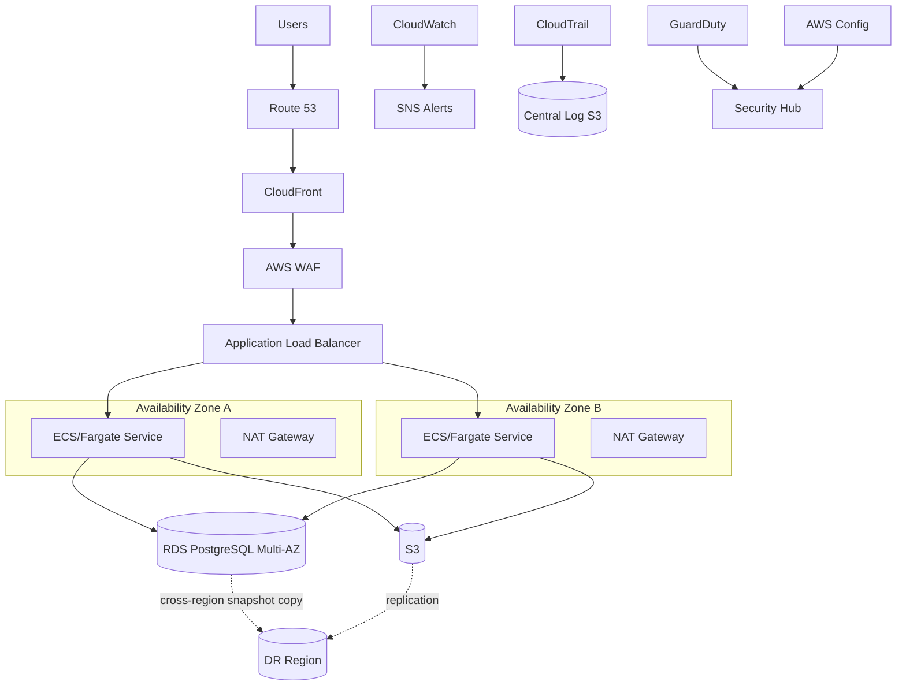

# ☁️ AWS Solutions Architect — Professional Services Portfolio


A professional-services style AWS Solutions Architect portfolio demonstrating how a customer engagement moves from **discovery and requirements** through **architecture, security, Terraform, CI/CD, observability, resilience, FinOps, validation, roadmap, and operational handoff**.

> **Portfolio scope:** This repository models a realistic customer engagement and contains deployable/reference-quality artifacts. It does not claim that these resources are currently running in a production AWS account.

## Executive Scenario

**Customer:** Northstar Digital Services  
**Business:** Mid-market B2B SaaS platform  
**Primary Region:** `us-east-1`  
**Secondary DR Region:** `us-west-2`  
**Availability Objective:** 99.9% application availability  
**RTO:** 60 minutes for regional disaster  
**RPO:** 15 minutes for transactional data  
**Security posture:** private application/data tiers, encrypted storage, centralized audit logging, least-privilege IAM, GuardDuty/Security Hub, WAF, AWS Config  
**Delivery model:** Terraform + GitHub Actions with pull-request validation and protected production apply

## Architecture at a Glance



Detailed diagrams and data flows are in `architecture/diagrams/`.

## What This Portfolio Proves

| Capability | Evidence |
|---|---|
| Customer discovery | `deliverables/Discovery_Workshop.md` |
| Requirements engineering | `deliverables/Requirements_Traceability_Matrix.md` |
| Solution architecture | `deliverables/Solution_Design_Document.md` |
| Architecture decisions | `architecture/adrs/` |
| AWS Well-Architected | `deliverables/Well_Architected_Review.md` |
| Security architecture | `security/Threat_Model.md`, `Security_Checklist.md`, `IAM_Design.md` |
| Infrastructure as Code | `iac/terraform/` |
| CI/CD | `cicd/github-actions.yml`, `cicd/Pipeline_Controls.md` |
| Observability | `observability/Observability_Strategy.md`, `Alarm_Catalog.md` |
| Resilience / DR | `resilience/Disaster_Recovery_Plan.md`, `Failure_Mode_Analysis.md` |
| FinOps | `finops/Cost_Optimization.md`, `Cost_Model.csv`, `Savings_Model.csv` |
| LOE / delivery planning | `deliverables/LOE_Estimate.md`, `Roadmap_90_Day.md` |
| Operations | `deliverables/Operations_Runbook.md` |
| Customer enablement | `customer-handoff/Knowledge_Transfer_Plan.md` |
| Quality validation | `validation/Acceptance_Test_Plan.md`, `validate_portfolio.py` |

## Design Principles

1. **Least privilege by default** — workloads use roles, not long-lived access keys.
2. **Private by default** — application tasks and databases run in private subnets.
3. **Multi-AZ by default** — production application and database tiers tolerate an AZ failure.
4. **Encryption everywhere** — KMS-backed encryption at rest and TLS in transit.
5. **Everything observable** — metrics, logs, traces, audit events, and actionable alarms.
6. **Cost is an architecture requirement** — budgets, tags, rightsizing, storage lifecycle, and commitment planning are built into the design.
7. **Recovery is tested** — RTO/RPO objectives are tied to concrete restore procedures.
8. **Changes are reviewed** — Terraform changes pass formatting, validation, security scanning, plan review, and controlled apply.

## Repository Structure

```text
aws-solutions-architect-professional-services-10of10/
├── README.md
├── architecture/
│   ├── Architecture_Principles.md
│   ├── adrs/
│   └── diagrams/
├── cicd/
│   ├── github-actions.yml
│   └── Pipeline_Controls.md
├── deliverables/
│   ├── Discovery_Workshop.md
│   ├── Requirements_Traceability_Matrix.md
│   ├── Solution_Design_Document.md
│   ├── Well_Architected_Review.md
│   ├── LOE_Estimate.md
│   ├── Roadmap_90_Day.md
│   └── Operations_Runbook.md
├── finops/
├── iac/terraform/
├── observability/
├── resilience/
├── security/
├── validation/
└── customer-handoff/
```

## Interview Talking Points

**Why ECS/Fargate?** It removes host-management overhead while preserving container portability and autoscaling.

**Why Multi-AZ RDS instead of self-managed database instances?** Managed backups, patching, automated failover, monitoring integration, and lower operational burden.

**Why warm-standby DR rather than active/active?** The 60-minute RTO and 15-minute RPO do not justify the cost/complexity of full active/active multi-region operation.

**How is cost controlled?** Mandatory tags, budgets, anomaly detection, log retention, S3 lifecycle, Fargate autoscaling, RDS rightsizing, and commitment analysis after usage stabilizes.

**How is deployment risk controlled?** Pull-request Terraform plan, static checks, IaC security scanning, manual production approval, remote state locking, and rollback/recovery procedures.

## Skills Demonstrated

**AWS • Solutions Architecture • Professional Services • Terraform • VPC • ALB • ECS/Fargate • RDS • S3 • Route 53 • CloudFront • WAF • IAM • KMS • CloudTrail • CloudWatch • AWS Config • GuardDuty • Security Hub • SNS • AWS Backup • CI/CD • GitHub Actions • FinOps • Well-Architected Framework • RTO/RPO • Disaster Recovery • Threat Modeling • Architecture Decision Records • LOE Estimation • Customer Handoff**

## Final Takeaway

This portfolio is designed to show a complete architecture engagement:

**discover → assess → design → decide → secure → automate → validate → observe → optimize → recover → hand off**
