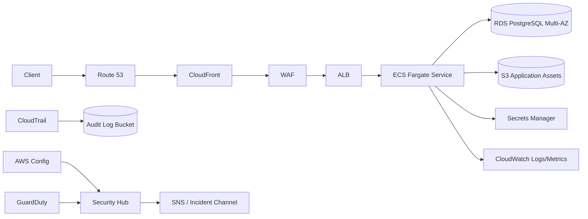

# Logical Architecture

## Trust Boundaries
1. Internet to AWS edge.
2. Edge to public ALB.
3. ALB to private application tasks.
4. Application to private database.
5. Workload plane to security/observability services.
