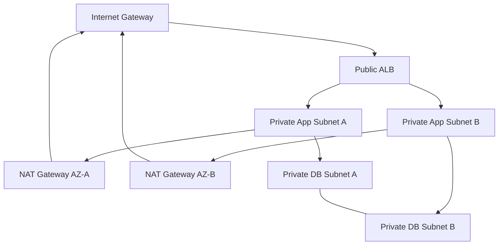

# Network Architecture

CIDR plan:
- VPC: `10.40.0.0/16`
- Public A: `10.40.0.0/24`
- Public B: `10.40.1.0/24`
- Private App A: `10.40.10.0/24`
- Private App B: `10.40.11.0/24`
- Private DB A: `10.40.20.0/24`
- Private DB B: `10.40.21.0/24`
