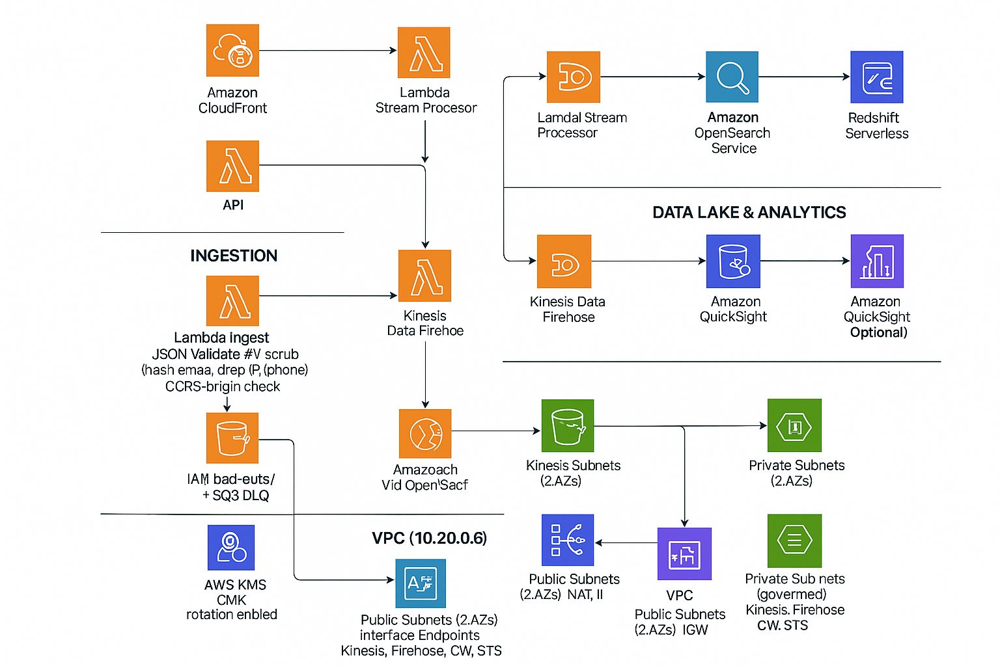

# 🧠 Real-Time Clickstream Analytics on AWS

### 🚀 Serverless | Secure | Scalable | Analytics-Driven

This project implements a **production-ready real-time clickstream analytics pipeline** — from edge ingestion to real-time dashboards and governed analytics — using **AWS CDK**.

---

## 📊 Architecture Overview



---

## 🏗️ System Design Breakdown

| Layer | Services | Description |
|-------|---------|-------------|
| Edge & Entry | CloudFront · WAF · API Gateway | Handles user event ingestion and protects from threats |
| Ingestion | Lambda (Validate + PII Scrub) · Kinesis Data Streams | Cleanses, validates, and streams click events securely |
| Streaming & Near-RT | Lambda Stream Processor · Firehose · OpenSearch (Cognito) | Real-time processing and indexing for dashboards |
| Data Lake & Analytics | S3 (Parquet) · Glue · Athena · QuickSight · Redshift Serverless | Persistent analytics lake with governed schema and BI insights |
| Security & Ops | KMS · IAM · CloudWatch · Cognito · WAF · DLQ | Governance, identity, encryption, monitoring |
| Networking | VPC (Public/Private Subnets + Endpoints) | Private data paths; no public S3 or NAT dependency |

---

## 🧩 Architecture Components
- **Ingest Lambda**: JSON validation, origin/CORS enforcement, PII scrub, DLQ on failure
- **Stream Processor Lambda**: Kinesis batch → Firehose (S3) + bulk index to OpenSearch
- **Data Lake**: Parquet + partitions (year/month/day/hour), Glue Catalog, Athena WorkGroup
- **Dashboards**: OpenSearch Dashboards (Cognito SSO) + QuickSight (DAU, Retention, Funnels)

---

## 🧮 Athena SQL Samples

**Daily Active Users**
```sql
SELECT date(from_iso8601_timestamp(created_at)) AS day,
       count(distinct user_id) AS dau
FROM clickstream.events
GROUP BY 1 ORDER BY 1 DESC;
```

**7-Day Retention**
```sql
WITH first_seen AS (
  SELECT user_id, date(min(from_iso8601_timestamp(created_at))) first_day
  FROM clickstream.events GROUP BY 1
),
activity AS (
  SELECT user_id, date(from_iso8601_timestamp(created_at)) day
  FROM clickstream.events
)
SELECT fs.first_day cohort,
       date_diff('week', fs.first_day, a.day) wk,
       count(distinct a.user_id) users
FROM first_seen fs JOIN activity a USING(user_id)
WHERE wk BETWEEN 0 AND 4
GROUP BY 1,2 ORDER BY 1,2;
```

---

## 🧭 Deployment

```bash
cd clickstream-analytics/cdk
npm install
npm run build
npx cdk bootstrap
npx cdk deploy
```
Outputs: API endpoint, Kinesis stream, S3 buckets, OpenSearch domain, Cognito pool info.

---

## 📁 Repository Structure
```
clickstream-analytics/
├── architecture/
├── analytics/
│   ├── athena/
│   └── quicksight/
├── cdk/
│   ├── bin/
│   └── lib/
├── lambda/
│   ├── ingest/
│   └── stream-processor/
├── clients/
│   ├── web-sdk/
│   └── generator/
├── ops/
└── .github/workflows/
```
