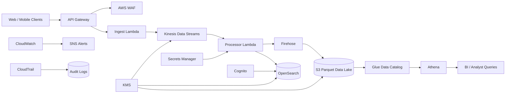

# 🧠 Real-Time Clickstream Analytics on AWS — Enterprise Architecture Edition


A production-style AWS Solutions Architect portfolio project for **high-volume real-time clickstream ingestion, durable analytics storage, near-real-time search, governed querying, observability, security, resilience, and cost control**.

This upgraded version preserves the original all-Python architecture—**AWS CDK (Python), API Gateway + WAF, Kinesis, Lambda stream processing, Firehose → S3 Parquet, OpenSearch, Glue/Athena, Cognito, KMS, IAM, and VPC endpoints**—while adding the enterprise-grade design and validation artifacts expected in a Solutions Architect portfolio.

## Executive Scenario

**Business:** StreamPulse, a digital commerce platform  
**Primary region:** `us-east-1`  
**Analytics objective:** searchable events in <60 seconds; durable lake data queryable in <15 minutes  
**Sustained design load:** **1,000 events/sec**  
**Peak design load:** **5,000 events/sec**  
**Average event size:** **1,024 bytes**  
**Sustained daily event volume:** **86.4M events/day**  
**Raw sustained ingestion:** **88.5 GB/day**  
**30-day raw volume:** **2.65 TB**  
**Modeled Parquet footprint:** **0.58 TB/month**

> These are transparent architecture-planning assumptions used for capacity and cost reasoning. They are not claims about a live production account.

## Architecture


```mermaid
flowchart LR
    WEB[Web / Mobile Clients] --> APIGW[API Gateway]
    APIGW --> WAF[AWS WAF]
    APIGW --> ING[Ingest Lambda]
    ING --> KDS[Kinesis Data Streams]
    KDS --> PROC[Processor Lambda]

    PROC --> FH[Firehose]
    FH --> S3[(S3 Parquet Data Lake)]
    PROC --> OS[(OpenSearch)]

    S3 --> GLUE[Glue Data Catalog]
    GLUE --> ATH[Athena]
    ATH --> BI[BI / Analyst Queries]

    COG[Cognito] --> OS
    SM[Secrets Manager] --> PROC
    KMS[KMS] --> S3
    KMS --> KDS
    KMS --> OS

    CW[CloudWatch] --> SNS[SNS Alerts]
    CT[CloudTrail] --> AUDIT[(Audit Logs)]
```

## Business Questions Supported

- Which pages/features drive conversion?
- Where does user engagement fall off?
- Which acquisition channels produce high-value sessions?
- What are the highest-volume event types?
- How quickly can security/operations investigate a specific user/session?
- Can historical events be queried efficiently without scanning raw JSON?
- How does the architecture behave during traffic bursts and downstream failures?

## Design Targets

| Target | Objective |
|---|---:|
| Sustained ingestion | 1,000 events/sec |
| Peak ingestion | 5,000 events/sec |
| API p95 latency | <250 ms |
| Near-real-time OpenSearch freshness | <60 sec p95 |
| S3 analytics freshness | <15 min p95 |
| Event durability | 99.99% design objective |
| Availability target | 99.9% ingestion plane |
| RTO | 60 minutes |
| RPO | ≤5 minutes for stream/lake path |
| Raw data retention | 30 days |
| Curated Parquet retention | 13 months |
| Audit-log retention | 365 days |

## Event Flow

1. Client posts a validated clickstream event to API Gateway.
2. WAF applies managed and rate-limit protections.
3. Ingest Lambda validates schema, adds server metadata, and writes to Kinesis.
4. Processor Lambda consumes batches from Kinesis.
5. Valid records are delivered to:
   - Firehose → S3 in Parquet for durable analytics.
   - OpenSearch for near-real-time operational/product exploration.
6. Poison records go to the DLQ/error prefix with enough metadata to replay.
7. Glue/Athena provide governed historical query access.
8. CloudWatch alarms watch latency, iterator age, errors, delivery failures, and storage/search health.

## Architecture Decisions

The project includes complete ADRs for:
- Kinesis vs SQS/MSK
- Lambda vs long-running consumers
- S3 Parquet partitioning
- OpenSearch as the near-real-time serving layer
- dual-write strategy and failure semantics
- regional DR strategy

See `architecture/adrs/`.

## Capacity Planning

The complete model is in `architecture/Capacity_Model.md`.

At 1,000 events/sec and 1,024 bytes/event:

- events/day: **86,400,000**
- raw GB/day: **88.5**
- raw TB/month: **2.65**
- estimated Parquet TB/month: **0.58**

The peak target is 5,000 events/sec. On-demand Kinesis is recommended for the portfolio scenario because traffic is bursty; provisioned mode is documented as an optimization option after load behavior is measured.

## Data Lake Layout

```text
s3://processed-clickstream/
  event_date=2026-08-23/
    event_hour=18/
      event_type=page_view/
        part-....parquet
```

This layout supports date/hour pruning while avoiding high-cardinality partition keys such as user ID or session ID.

## Security

- API Gateway protected by WAF.
- Kinesis, S3, and OpenSearch encrypted.
- IAM roles use scoped permissions.
- Secrets Manager stores OpenSearch/application secrets.
- S3 public access is blocked.
- OpenSearch is deployed in VPC/private networking in the reference design.
- CloudTrail provides control-plane audit history.
- Cognito gates dashboard access.
- Input validation rejects malformed event types and oversized payloads.

## Reliability

The project includes:
- Kinesis retention buffer
- Lambda partial-batch failure handling
- Firehose error prefix
- DLQ/replay procedures
- OpenSearch failure isolation
- S3 as durable system of analytical record
- explicit RTO/RPO
- failure-mode analysis
- regional recovery plan

## Observability

Critical signals:
- API 4xx/5xx and latency
- Lambda errors, throttles, duration
- Kinesis iterator age and write throttles
- Firehose delivery failures
- OpenSearch cluster status, JVM pressure, storage
- S3 delivery volume
- DLQ/error-record growth

See `ops/Alarm_Catalog.md` and `ops/Operations_Runbook.md`.

## FinOps

The included model uses explicit scenario assumptions rather than claiming a real AWS bill.

**Modeled baseline:** **$11,500/month**  
**Modeled optimization backlog:** **$1,520/month**  
**Modeled optimized run rate:** **$9,980/month**  
**Modeled annual savings:** **$18,240**  
**Modeled reduction:** **13.2%**

## Repository Structure

```text
clickstream-analytics-10of10/
├── README.md
├── architecture/
│   ├── Capacity_Model.md
│   ├── Data_Flow.md
│   ├── Architecture_Review.md
│   ├── diagrams/
│   └── adrs/
├── analytics/
│   ├── athena_queries.sql
│   ├── glue_table.sql
│   ├── KPI_Catalog.md
│   └── Data_Quality_Rules.md
├── cdk/
│   ├── app.py
│   ├── clickstream_stack.py
│   ├── cdk.json
│   └── requirements.txt
├── clients/generator/
├── lambda/
│   ├── ingest/
│   └── processor/
├── schemas/
│   ├── clickstream_event.schema.json
│   └── sample_events.jsonl
├── security/
├── resilience/
├── finops/
├── ops/
├── validation/
└── .github/workflows/
```

## Interview Talking Points

**Why Kinesis?** Ordered stream ingestion, shard/on-demand scaling, replay window, and native Lambda integration fit real-time event processing.

**Why dual-write to OpenSearch and S3?** OpenSearch serves low-latency exploration; S3 is the durable, lower-cost analytics system of record. Each layer solves a different access pattern.

**Why Parquet?** Columnar compression and projection reduce Athena scan cost and improve analytical query performance.

**Why not partition by user ID?** High-cardinality partitions create too many small objects/partitions. Date/hour/event-type balances pruning and manageability.

**What happens if OpenSearch is down?** The durable S3 path remains authoritative. Failed OpenSearch writes are retried and can be replayed from the stream/error store without sacrificing the historical lake.

## Skills Demonstrated

**AWS Solutions Architecture • Python • AWS CDK • API Gateway • WAF • Kinesis • Lambda • Firehose • S3 • Parquet • Glue • Athena • OpenSearch • Cognito • IAM • KMS • Secrets Manager • CloudWatch • CloudTrail • Data Engineering • Streaming Architecture • Capacity Planning • FinOps • RTO/RPO • Disaster Recovery • Failure Analysis • Data Quality • Load Testing**

## Final Takeaway

This project now demonstrates the complete architecture lifecycle:

**event contract → ingestion → streaming → processing → dual serving paths → durable lake → querying → security → observability → failure recovery → capacity planning → cost optimization → validation**
