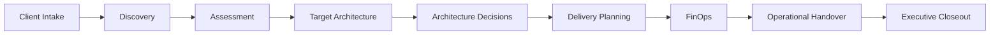
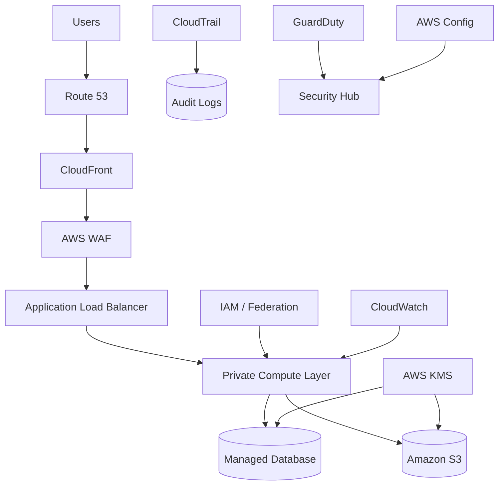
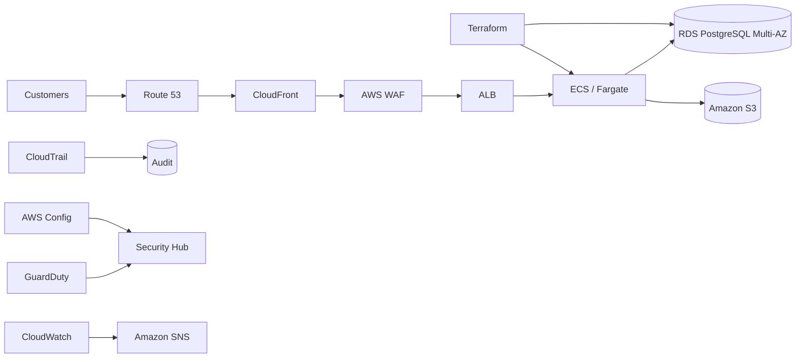

# 🧰 AWS Cloud Consulting Toolkit


> **Reusable AWS Solutions Architecture & Professional Services Framework for Discovery, Assessment, Design, Delivery, FinOps, Handover, and Presales**

A comprehensive AWS cloud consulting toolkit demonstrating how a **Solutions Architect / Cloud Consultant** can take a customer engagement from the first discovery conversation through architecture design, implementation planning, operational handoff, and executive closeout.

This repository is designed around the complete consulting lifecycle:

**Intake → Discovery → Assessment → Architecture → Delivery → FinOps → Handover → Executive Closeout**

Rather than demonstrating only AWS technical knowledge, this project demonstrates how architecture decisions are connected to:

- Business requirements
- Stakeholder priorities
- Security
- Reliability
- Cost
- Risk
- Operations
- Project delivery
- Executive communication

---

# 🎯 Purpose

AWS consulting engagements require more than drawing architecture diagrams.

A Solutions Architect must be able to:

- Discover business requirements
- Understand the current environment
- Identify technical risks
- Evaluate AWS architecture
- Facilitate stakeholder discussions
- Define non-functional requirements
- Recommend target-state architecture
- Document architectural decisions
- Manage risks and dependencies
- Estimate implementation effort
- Evaluate cloud costs
- Plan disaster recovery
- Define operational ownership
- Communicate recommendations to executives

This toolkit provides reusable artifacts for that entire process.

---

# 🧭 Consulting Lifecycle



Each phase produces documentation that becomes evidence for the next phase.

---

# 🗂️ Repository Structure

```text
consulting-toolkit/
│
├── README.md
│
├── 00_intake/
│   ├── Client_Intake_Questionnaire.md
│   ├── Discovery_Workshop_Agenda.md
│   └── Stakeholder_Map.md
│
├── 01_assessment/
│   ├── Well_Architected_Assessment.md
│   ├── Security_Assessment.md
│   └── Cloud_Maturity_Scorecard.csv
│
├── 02_design/
│   ├── High_Level_Design.md
│   ├── Threat_Model.md
│   ├── Requirements_Traceability.md
│   └── adrs/
│       ├── ADR-001-IaC.md
│       ├── ADR-002-MultiAZ.md
│       └── ADR-003-Identity.md
│
├── 03_delivery/
│   ├── Project_Plan.md
│   ├── RAID_Log.csv
│   └── Weekly_Status_Report.md
│
├── 04_finops/
│   ├── FinOps_Playbook.md
│   └── Savings_Estimator.csv
│
├── 05_handover/
│   ├── Operations_Runbook.md
│   ├── Operational_Acceptance.md
│   └── Knowledge_Transfer.md
│
├── 06_presales/
│   ├── Statement_of_Work.md
│   ├── LOE_Estimator.csv
│   └── Executive_One_Pager.md
│
├── 07_example_engagement/
│   ├── Executive_Summary.md
│   ├── Architecture.md
│   └── Completed_Risk_Register.csv
│
├── templates/
│   ├── ADR_Template.md
│   └── Runbook_Template.md
│
├── evidence/
│   ├── Architecture_Review_Board_Record.md
│   ├── Consulting_Deliverable_Traceability.csv
│   ├── Example_Engagement_Closeout.md
│   ├── Validation_Report.md
│   └── artifact_manifest.csv
│
└── validation/
    └── validate.py
```

---

# 1️⃣ Client Intake

The engagement begins by understanding the customer before recommending technology.

The intake process captures:

### Business

- Business objectives
- Target outcomes
- Project deadlines
- Business constraints
- Applications in scope
- Critical business processes

### Technical

- Existing architecture
- AWS accounts
- Regions
- Applications
- Databases
- Networking
- CI/CD
- Infrastructure as Code
- Monitoring
- Backup
- Disaster recovery

### Security

- Data classification
- Compliance requirements
- Identity provider
- Encryption requirements
- Logging requirements
- Vulnerability management

### Operations

- Support hours
- Incident procedures
- Change management
- RTO
- RPO
- Availability objectives

### Financial

- Current AWS spending
- Budget ownership
- Cost allocation
- Savings Plans
- Reserved Instances
- Cost optimization process

---

# 📝 Client Intake Questionnaire

The `Client_Intake_Questionnaire.md` provides a reusable questionnaire that can be sent before the first technical workshop.

The objective is to enter discovery with enough context to ask meaningful architecture questions rather than spending the entire session collecting basic information.

---

# 2️⃣ Discovery Workshop

A structured **90-minute discovery workshop** is included.

## Workshop Flow

| Time | Topic |
|---|---|
| 0–10 min | Business outcomes |
| 10–25 min | Current architecture |
| 25–40 min | Applications, data & integrations |
| 40–55 min | Security & compliance |
| 55–65 min | Reliability & DR |
| 65–75 min | Cost & FinOps |
| 75–85 min | Constraints & dependencies |
| 85–90 min | Decisions & next actions |

---

# ✅ Discovery Exit Criteria

Discovery should not be considered complete until the team understands:

- Business objective
- Project scope
- Major applications
- Data flows
- Availability requirements
- Security requirements
- RTO/RPO
- Cost constraints
- Major dependencies
- Top architecture risks

---

# 👥 Stakeholder Management

Cloud architecture decisions rarely involve only engineers.

The stakeholder map identifies:

| Stakeholder | Primary Concern |
|---|---|
| Executive Sponsor | Business outcome |
| Product Owner | Customer value |
| Engineering Lead | Implementation |
| Security Lead | Security controls |
| Operations Lead | Supportability |
| Finance Partner | Cost |
| Solutions Architect | Architecture |

---

# 🏛️ Decision Rights

Different stakeholders own different decisions.

Example:

```text
Executive Sponsor
      ↓
Budget / Scope

Product Owner
      ↓
Business Priorities

Security Lead
      ↓
Security Approval

Engineering
      ↓
Implementation

Operations
      ↓
Operational Acceptance

Solutions Architect
      ↓
Architecture Recommendation
```

This reduces ambiguity during delivery.

---

# 3️⃣ AWS Well-Architected Assessment

The toolkit evaluates architecture across the AWS Well-Architected pillars.

## Operational Excellence

Example assessment:

**Score: 3/5**

Strengths:

- Git-based source control
- Basic monitoring

Gaps:

- Manual infrastructure changes
- Incomplete runbooks

Recommendations:

- Infrastructure as Code
- CI/CD gates
- Operational runbooks
- Game days

---

## Security

Example:

**Score: 3/5**

Strengths:

- MFA
- Encryption

Gaps:

- Broad IAM access
- Incomplete security findings aggregation

Recommendations:

- Federation
- Least privilege
- GuardDuty
- Security Hub
- AWS Config
- Threat modeling

---

## Reliability

Example:

**Score: 2/5**

Risks:

- Single-AZ dependencies
- Untested recovery procedures

Recommendations:

- Multi-AZ
- Explicit RTO/RPO
- Restore testing
- Failure-mode analysis

---

## Performance Efficiency

Example:

**Score: 3/5**

Recommendations:

- Capacity modeling
- Autoscaling
- Database performance analysis
- Load testing

---

## Cost Optimization

Example:

**Score: 2/5**

Gaps:

- Weak tagging
- No recurring rightsizing process

Recommendations:

- Tagging standards
- AWS Budgets
- Cost Anomaly Detection
- Monthly FinOps reviews

---

## Sustainability

Example:

**Score: 3/5**

Opportunities:

- Autoscaling
- Managed services
- Serverless architecture
- Storage lifecycle
- Idle-resource cleanup

---

# 📊 Cloud Maturity Scorecard

The toolkit scores organizational maturity.

| Domain | Current | Target | Priority |
|---|---:|---:|---|
| Governance | 2/5 | 4/5 | High |
| Security | 3/5 | 5/5 | High |
| Reliability | 2/5 | 4/5 | High |
| Operations | 2/5 | 4/5 | High |
| Automation | 2/5 | 5/5 | High |
| FinOps | 2/5 | 4/5 | Medium |
| Data | 3/5 | 4/5 | Medium |
| Delivery | 3/5 | 5/5 | High |

This converts qualitative findings into a prioritized transformation roadmap.

---

# 🔐 Security Assessment

The toolkit contains a dedicated cloud security review.

Example findings:

| Domain | Finding | Severity | Recommendation |
|---|---|---:|---|
| IAM | Broad human admin access | High | Federation + role separation |
| Secrets | Secrets stored in files | High | AWS Secrets Manager |
| Network | Broad database access | High | SG-to-SG access |
| Logging | CloudTrail not centralized | Medium | Central audit account |
| Detection | GuardDuty absent | Medium | GuardDuty + Security Hub |
| S3 | Inconsistent public controls | High | Account-level public block |
| Encryption | Default keys only | Medium | KMS strategy |
| DR | Recovery not tested | High | Recovery exercises |

---

# 🛡️ Threat Modeling

Architecture design includes explicit threat analysis.

## Protected Assets

- Customer data
- Credentials
- AWS control plane
- Infrastructure state
- Logs
- Secrets

## Example Threats

```text
Stolen Credentials
Privilege Escalation
Public Data Exposure
Application Injection
Supply Chain Compromise
Ransomware
Data Exfiltration
Destructive Admin Actions
```

## Controls

```text
Federation
MFA
Least Privilege
AWS KMS
AWS WAF
Private Subnets
AWS CloudTrail
AWS Config
Amazon GuardDuty
AWS Security Hub
Versioned Backups
CI Security Scanning
```

---

# 4️⃣ Target Architecture Design

A reference target architecture follows a layered model:



---

# 📋 Non-Functional Requirements

Architecture is driven by measurable requirements.

Example:

| Requirement | Target |
|---|---|
| Availability | **99.9%** |
| RTO | **60 minutes** |
| RPO | **15 minutes** |
| Critical Alert Acknowledgement | **15 minutes** |
| Infrastructure Drift | **Zero unmanaged production changes** |

---

# 🔗 Requirements Traceability

Requirements are mapped directly to architecture controls.

| ID | Requirement | Design Control | Validation |
|---|---|---|---|
| NFR-01 | 99.9% availability | Multi-AZ | AZ game day |
| NFR-02 | RTO 60 min | DR runbook | Recovery exercise |
| NFR-03 | RPO 15 min | PITR / backups | Restore review |
| SEC-01 | Private database | Private subnet | Config review |
| SEC-02 | Least privilege | Scoped IAM | IAM review |
| OPS-01 | Monitoring | CloudWatch | Alarm test |
| FIN-01 | Cost allocation | Tags | Tag audit |

This ensures architecture decisions are tied directly to customer requirements.

---

# 📝 Architecture Decision Records

Major technical decisions are documented using ADRs.

Included decisions cover:

### ADR-001 — Infrastructure as Code

Production infrastructure should be managed using:

```text
Terraform
or
AWS CDK
```

Console-only production changes are emergency exceptions.

---

### ADR-002 — Multi-AZ

Production systems should tolerate the loss of a single Availability Zone where supported by workload requirements.

---

### ADR-003 — Federated Identity

Human access should use:

```text
SSO / Federation
+
Short-Lived Role Sessions
```

rather than long-lived IAM user credentials.

---

# ⚖️ Architecture Tradeoffs

A Solutions Architect should explain why a design was chosen.

Example:

### Multi-AZ

**Benefit**

Higher availability.

**Tradeoff**

Higher infrastructure cost.

### Managed Services

**Benefit**

Lower operational burden.

**Tradeoff**

Potentially higher service cost and reduced low-level control.

### Serverless

**Benefit**

Elastic scaling and reduced infrastructure management.

**Tradeoff**

Workload-specific limits and potentially unpredictable cost under extreme traffic.

The toolkit documents these tradeoffs instead of presenting architecture decisions as universally correct.

---

# 5️⃣ Delivery Planning

The toolkit converts architecture into an executable implementation plan.

## Example Six-Week Delivery

### Week 1

```text
Discovery
Evidence Collection
Current-State Architecture
```

### Week 2

```text
Assessment
Security Review
Target Architecture
```

### Week 3

```text
IaC Foundation
Networking
Identity
```

### Week 4

```text
Application
Data
Security Controls
```

### Week 5

```text
Observability
Disaster Recovery
FinOps
```

### Week 6

```text
Validation
Game Day
Documentation
Handoff
```

---

# 🚦 Definition of Done

The engagement is complete when:

- Architecture is approved
- Security controls are validated
- Cost model is reconciled
- Acceptance testing is completed
- Runbooks are delivered
- Operations accepts ownership
- Residual risks have named owners

---

# ⚠️ RAID Management

The project includes a complete RAID framework.

```text
R = Risks
A = Assumptions
I = Issues
D = Dependencies
```

Example:

| Type | Description | Impact | Owner |
|---|---|---|---|
| Risk | Regional outage | High | Platform |
| Risk | Overbroad IAM | High | Security |
| Assumption | Primary region remains us-east-1 | Medium | Sponsor |
| Issue | Incomplete cost tags | Medium | Finance |
| Dependency | Identity-provider integration | High | Security |

---

# 📅 Weekly Status Reporting

Consulting communication includes:

### Green

Items progressing normally.

### Amber

Items requiring attention.

### Red

Items threatening delivery.

The status report also captures:

- Decisions
- Risks
- Dependencies
- Next-week priorities
- Required customer actions

---

# 6️⃣ FinOps

Architecture decisions must include financial impact.

The toolkit establishes:

```text
Allocate
    ↓
Detect
    ↓
Optimize
    ↓
Govern
    ↓
Measure
```

---

# 🏷️ Required Cost Tags

```text
Environment
Application
Owner
CostCenter
ManagedBy
```

Target:

**≥98% tagged spend**

---

# 💰 Optimization Areas

The toolkit evaluates:

- Compute rightsizing
- Storage lifecycle
- Graviton
- Commitment plans
- Idle resources
- Logging
- Data transfer
- Database utilization

---

# 📊 Example Modeled Savings

| Action | Modeled Monthly Savings |
|---|---:|
| Compute Rightsizing | $1,800 |
| Storage Lifecycle | $630 |
| Graviton | $960 |
| Commitment Planning | $1,800 |
| Unused Resources | $1,000 |

These are scenario-planning values rather than claims of realized customer savings.

---

# 🔄 FinOps Governance

Recommended cadence:

### Weekly

Cost anomaly review.

### Monthly

Engineering + Finance cost review.

### Quarterly

Architecture and commitment review.

---

# 7️⃣ Operational Handover

A consulting engagement is not finished when infrastructure is deployed.

It is finished when operations can support it.

The toolkit provides:

- Operations runbook
- Operational acceptance checklist
- Knowledge-transfer plan
- Incident guidance
- Recovery procedures
- Ownership documentation

---

# 🚨 Incident Severity

## SEV-1

Major outage or security incident.

Target acknowledgement:

**≤15 minutes**

Actions:

```text
Assign Incident Commander
Preserve Timeline
Contain Impact
Restore Service
Validate Recovery
Perform RCA
```

---

## SEV-2

Service degradation.

Target acknowledgement:

**≤30 minutes**

Actions:

- Review metrics
- Review logs
- Identify dependency failures
- Restore normal operation

---

# 🔄 Operational Cadence

## Monthly

- Access review
- Backup evidence
- Cost review
- Alarm testing
- Runtime/patch review

## Quarterly

- DR exercise
- IAM review
- Well-Architected action review

---

# 🎓 Knowledge Transfer

The handover includes six structured sessions.

### Session 1

Architecture and networking.

### Session 2

Infrastructure as Code and CI/CD.

### Session 3

Security and threat detection.

### Session 4

Monitoring and incidents.

### Session 5

Disaster recovery.

### Session 6

FinOps.

---

# ✅ Knowledge Transfer Success

Operations should be able to:

- Explain architecture dependencies
- Run an infrastructure plan
- Locate logs
- Investigate alarms
- Restore data
- Review security findings
- Perform cost review

without relying on the consulting team.

---

# 8️⃣ Presales & Scoping

Solutions Architects frequently participate before an engagement is sold.

The toolkit includes:

- Statement of Work
- Level-of-Effort estimator
- Executive one-pager
- Assumptions
- Exclusions
- Acceptance criteria

---

# 📃 Statement of Work

Example objective:

> Assess and modernize the customer's AWS platform to improve security, reliability, automation, and cost governance.

## In Scope

- Discovery
- Assessment
- Architecture
- IaC foundation
- Security
- Observability
- DR
- FinOps
- Handover

## Exclusions

- Application feature development
- Penetration testing
- 24×7 managed services

Explicit exclusions help prevent scope creep.

---

# ⏱️ Level-of-Effort Estimation

The LOE estimator separates effort between:

```text
Solutions Architect
Engineering
Security
```

Example workstreams:

- Discovery
- Assessment
- Architecture
- IaC
- Security
- Observability
- DR
- FinOps
- Handoff

This demonstrates that architecture recommendations must also be deliverable within realistic staffing constraints.

---

# 9️⃣ Example End-to-End Engagement

The repository contains a fully completed sample engagement:

# Northstar Commerce Modernization

Northstar operates a customer-facing commerce platform with:

- Manual deployments
- Single-AZ database risk
- Broad permissions
- Weak cost allocation
- Limited recovery evidence

---

# 🏗️ Northstar Target Architecture



---

# 📌 Northstar Architecture Improvements

## Before

```text
Manual Changes
Single-AZ Database
Broad IAM
Weak Cost Allocation
Limited DR Evidence
```

## After

```text
Infrastructure as Code
Multi-AZ Database
Federated IAM
Security Detection
CloudWatch Monitoring
Defined RTO/RPO
FinOps Governance
Operational Runbooks
```

---

# 💰 Example Business Case

Modeled baseline:

**$42,000/month**

Modeled optimization backlog:

**$7,350/month**

Modeled annual opportunity:

**$88,200**

Potential modeled reduction:

**~17.5%**

These figures are scenario assumptions, not claims of realized customer savings.

---

# 🛡️ Architecture Review Board

The example engagement includes a formal architecture review.

## Decision

**Approved with tracked residual risks**

Required production gates include:

- Identity-provider integration
- DR exercise
- Operational acceptance

Commitment purchasing remains deferred until workload usage stabilizes.

---

# 📋 Residual Risk Management

Example:

| Risk | Owner | Requirement |
|---|---|---|
| Identity integration | Security | Close before production |
| DR exercise | Platform | Production gate |
| Commitment purchase | Finance | Review after stable usage |

This demonstrates that good architecture does not pretend risk can always be eliminated.

Risk is:

```text
Identified
    ↓
Measured
    ↓
Mitigated
    ↓
Owned
    ↓
Accepted
```

---

# 🔍 Architecture Review Questions

Every engagement should be able to answer:

### Business

What business outcome are we solving?

### Requirements

What measurable success criteria exist?

### Architecture

Why was this design selected?

### Security

How is data protected?

### Reliability

What happens when components fail?

### DR

What are the RTO and RPO?

### Operations

Who supports the system?

### Cost

How much should the architecture cost?

### Risk

What remains unresolved?

### Validation

What evidence proves the architecture meets its requirements?

---

# 🧾 Verification Evidence

The `evidence/` directory provides additional consulting proof.

Included artifacts:

```text
Architecture_Review_Board_Record.md
Consulting_Deliverable_Traceability.csv
Example_Engagement_Closeout.md
Validation_Report.md
artifact_manifest.csv
```

These artifacts connect:

```text
Business Need
      ↓
Requirement
      ↓
Architecture Decision
      ↓
Deliverable
      ↓
Validation
      ↓
Acceptance
```

---

# 🔐 Artifact Integrity

The project includes a SHA-256 artifact manifest.

This provides an auditable inventory of project files and demonstrates basic deliverable-integrity practices.

---

# 🧪 Validation

The toolkit contains automated validation to verify that required consulting artifacts exist.

Core validation checks include:

- README
- Client intake
- Well-Architected assessment
- High-level design
- RAID log
- FinOps playbook
- Operations runbook
- Statement of Work
- Example engagement

The goal is to prevent an incomplete consulting package from being treated as finished.

---

# 🧰 AWS Services & Concepts Demonstrated

## Architecture

- Amazon Route 53
- Amazon CloudFront
- AWS WAF
- Application Load Balancer
- Amazon ECS / AWS Fargate
- Amazon RDS
- Amazon S3

## Security

- AWS IAM
- IAM Identity Center / Federation
- AWS KMS
- AWS Secrets Manager
- AWS CloudTrail
- AWS Config
- Amazon GuardDuty
- AWS Security Hub

## Operations

- Amazon CloudWatch
- Amazon SNS
- Backup / Restore
- Disaster Recovery

## Financial Management

- AWS Cost Explorer concepts
- AWS Budgets
- Cost Allocation Tags
- FinOps

## Infrastructure

- Terraform
- AWS CDK concepts
- Infrastructure as Code
- CI/CD

---

# 🎓 Consulting Skills Demonstrated

**AWS Solutions Architecture • Cloud Consulting • AWS Professional Services • Discovery Workshops • Stakeholder Management • Requirements Gathering • AWS Well-Architected Framework • Cloud Security Assessments • Threat Modeling • Architecture Decision Records • High-Level Design • Requirements Traceability • RAID Management • Project Planning • Disaster Recovery • RTO/RPO • FinOps • Cost Optimization • Statement of Work • Level-of-Effort Estimation • Operational Handover • Knowledge Transfer • Executive Communication**

---

# 💼 Interview Story

A concise way to explain this project:

> I built an AWS cloud consulting toolkit to demonstrate how I would manage an architecture engagement from discovery through operational handoff. The framework includes client intake, stakeholder mapping, Well-Architected and security assessments, target architecture, threat modeling, ADRs, requirements traceability, RAID management, FinOps, SOW and LOE estimation, operational runbooks, and knowledge transfer. I also completed an end-to-end example modernization engagement showing how technical recommendations connect to business outcomes, security risks, recovery objectives, cost, and executive decisions.

---

# 🗣️ Interview Questions This Project Supports

This portfolio gives concrete examples for questions such as:

**“How do you gather requirements?”**

Use the intake questionnaire, stakeholder map, discovery workshop, and requirements traceability.

**“How do you evaluate an existing AWS environment?”**

Use the Well-Architected assessment, security assessment, maturity scorecard, and risk register.

**“How do you make architecture decisions?”**

Use ADRs, threat modeling, NFRs, tradeoff analysis, and traceability.

**“How do you handle stakeholders?”**

Use stakeholder mapping, decision rights, status reporting, and executive communication.

**“How do you approach cloud cost?”**

Use the FinOps playbook, savings model, tagging standard, and review cadence.

**“How do you hand a system to operations?”**

Use the runbook, operational acceptance criteria, knowledge-transfer plan, and DR procedures.

---

# 🏁 Final Takeaway

This toolkit demonstrates the complete AWS Solutions Architect consulting lifecycle:

```text
Business Problem
       ↓
Client Intake
       ↓
Discovery
       ↓
Stakeholder Alignment
       ↓
Current-State Assessment
       ↓
Well-Architected Review
       ↓
Security Assessment
       ↓
Requirements
       ↓
Target Architecture
       ↓
Threat Modeling
       ↓
Architecture Decisions
       ↓
Delivery Planning
       ↓
Risk Management
       ↓
FinOps
       ↓
Validation
       ↓
Operational Handover
       ↓
Executive Closeout
```

The goal is not simply to demonstrate knowledge of AWS services.

The goal is to demonstrate the ability to translate **business requirements into secure, reliable, cost-aware AWS architecture—and then communicate, validate, deliver, and operationalize that architecture like a professional cloud consultant.**

---

## ⚠️ Portfolio Scope

This repository represents a **simulated AWS consulting environment** created to demonstrate Solutions Architect and cloud consulting skills.

The example customer, architecture engagement, financial figures, maturity scores, risks, timelines, and business outcomes are portfolio scenarios unless explicitly supported by executed evidence.

The repository does **not** claim that the example engagement was performed for a real customer or that modeled savings were realized in a live AWS environment.

---

**Author:** Jamie Christian II  
**Portfolio:** AWS Solutions Architecture & Cloud Consulting
