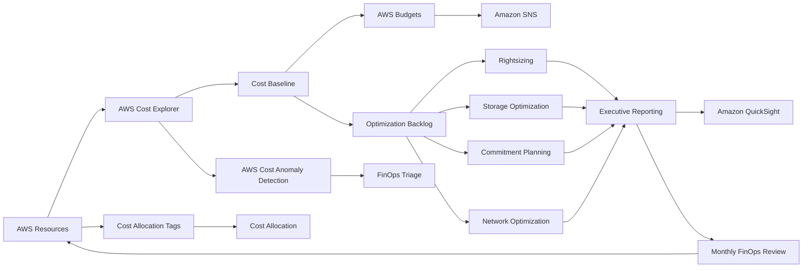

# 💸 AWS FinOps Framework


> **Cloud Financial Management, Cost Allocation, Forecasting, Optimization, Governance & Executive Reporting on AWS**

A production-style **AWS FinOps framework** demonstrating how organizations can establish financial accountability for cloud infrastructure while balancing **cost, performance, reliability, security, and business value**.

This project goes beyond identifying expensive AWS resources.

It demonstrates the complete FinOps lifecycle:

**Inform → Allocate → Detect → Analyze → Optimize → Govern → Measure**

The framework includes cost modeling, tagging standards, budget controls, anomaly management, optimization backlogs, commitment planning, unit economics, executive reporting, automation, governance, and evidence-based financial decision making.

---

# 🎯 Business Problem

AWS environments can grow rapidly as engineering teams deploy:

- EC2 instances
- Containers
- Databases
- Storage
- Analytics platforms
- Serverless applications
- Networking infrastructure
- Observability services

Without financial governance, organizations can experience:

- Unexpected cloud bills
- Idle infrastructure
- Oversized compute
- Excess storage
- Poor resource ownership
- Unallocated costs
- Inefficient data transfer
- Uncontrolled logging costs
- Poor commitment decisions
- Limited executive visibility

The objective of this framework is to create a repeatable cloud financial operating model where:

```text
Every Dollar
     ↓
Has an Owner
     ↓
Has a Business Purpose
     ↓
Can Be Measured
     ↓
Can Be Optimized
     ↓
Can Be Governed
```

---

# 🏢 FinOps Scenario

This portfolio models an established AWS environment containing:

- Compute workloads
- Containers
- Managed databases
- Object storage
- Search workloads
- Serverless applications
- Monitoring
- Backups
- Network services

## Modeled Monthly Cost Baseline

| AWS Cost Area | Monthly Cost |
|---|---:|
| EC2 / ECS | **$18,500** |
| RDS / Aurora | **$12,400** |
| OpenSearch | **$6,100** |
| NAT / Data Transfer | **$4,200** |
| S3 | **$3,900** |
| CloudWatch | **$2,300** |
| Backups | **$2,100** |
| Lambda / API | **$1,800** |
| Other Services | **$2,700** |
| **Total** | **$54,000/month** |

> All financial figures in this portfolio are **modeled architecture-planning values**, not claims from a live AWS billing account.

---

# 📊 FinOps Operating Model



---

# 🔄 FinOps Lifecycle

## 1. Inform

Understand:

- What are we spending?
- Which services drive cost?
- Which environments are growing?
- Who owns each resource?
- What changed this month?

---

## 2. Allocate

Map cloud spend to:

- Applications
- Teams
- Business units
- Cost centers
- Environments
- Products

---

## 3. Detect

Identify:

- Cost anomalies
- Budget overruns
- Unexpected usage
- Idle infrastructure
- Sudden service growth

---

## 4. Optimize

Evaluate:

- Rightsizing
- Graviton
- Storage lifecycle
- Data-transfer architecture
- Serverless capacity
- Commitment discounts
- Idle-resource cleanup

---

## 5. Govern

Create:

- Budget policies
- Tagging policies
- Optimization ownership
- Escalation procedures
- Monthly review cadence

---

## 6. Measure

Track:

- Savings realized
- Savings pipeline
- Forecast accuracy
- Unit economics
- Tag compliance
- Unallocated spend
- Commitment utilization

---

# 🏷️ Cost Allocation Strategy

Cloud cost cannot be governed effectively without ownership.

Required tags:

```text
Environment
Application
Owner
CostCenter
BusinessUnit
ManagedBy
DataClassification
```

Example:

```text
Environment=Production
Application=RetailAnalytics
Owner=DataPlatform
CostCenter=CC-204
BusinessUnit=Commerce
ManagedBy=Terraform
DataClassification=Internal
```

---

# 🎯 Tagging Targets

| KPI | Target |
|---|---:|
| Allocatable Spend Tagged | **≥98%** |
| Unallocated Spend | **<2%** |
| Production Ownership | **100%** |
| Cost Center Coverage | **≥98%** |

Controlled tag vocabularies prevent values such as:

```text
prod
production
Production
PROD
```

from being treated as separate environments.

Instead:

```text
Environment=Production
```

is standardized.

---

# 💵 Cost Allocation Model

Direct workload costs are allocated using:

```text
Application
+
CostCenter
+
BusinessUnit
```

Shared infrastructure costs can be distributed using:

- Compute usage
- Storage usage
- Request volume
- Account count
- Proportional direct spend

Example:

```text
Shared Platform Cost
        ↓
Allocation Driver
        ↓
Application Teams
        ↓
Business Units
```

The goal is to reduce unattributed cloud spending to:

**<2%**

---

# 🚨 AWS Budget Framework

Budget controls provide early warning before cost overruns become financial surprises.

## Recommended Thresholds

| Threshold | Trigger | Action |
|---|---|---|
| **50% Actual** | Mid-month | Informational |
| **80% Forecast** | Forecast approaching budget | Owner review |
| **100% Forecast/Actual** | Budget reached | Finance + engineering action |
| **110% Actual** | Material overrun | Executive escalation |

---

# 📣 Notification Flow

```text
AWS Budget
     ↓
Threshold Trigger
     ↓
Amazon SNS
     ↓
FinOps / Engineering
     ↓
Cost Investigation
     ↓
Corrective Action
```

Budget alerts should identify:

- Account
- Environment
- Application
- Cost center
- Budget owner

---

# 🔎 Cost Anomaly Detection

AWS Cost Anomaly Detection is used to identify unexpected changes.

Example:

```text
Normal EC2 Spend
      ↓
Unexpected Increase
      ↓
Cost Anomaly
      ↓
Alert
      ↓
FinOps Investigation
```

---

# 🚑 Cost Anomaly Response Runbook

When an anomaly occurs:

### 1. Identify

Determine:

```text
Service
Account
Region
Usage Type
Application
Owner
```

### 2. Validate

Determine whether the increase was:

- Approved
- Expected
- Temporary
- Accidental

### 3. Contain

For unintended nonproduction cost:

- Stop unnecessary resources
- Scale down capacity
- Disable accidental workloads

Only after appropriate owner approval.

### 4. Quantify

Calculate:

```text
Incremental Cost
+
Expected Monthly Impact
```

### 5. Root Cause

Examples:

- Autoscaling configuration
- Unused EC2 instance
- Excessive logging
- Unexpected data transfer
- Query scan growth
- Unplanned database scaling

### 6. Prevent

Implement:

- Budget controls
- IaC policies
- Scaling limits
- Lifecycle policies
- Tagging requirements

### 7. Close

Document:

```text
Root Cause
Financial Impact
Corrective Action
Preventive Control
Owner
```

---

# 📉 Cost Optimization Backlog

Optimization recommendations are tracked as engineering work rather than informal suggestions.

| Optimization | Addressable Cost | Modeled Savings |
|---|---:|---:|
| Compute Rightsizing | $18,500 | **14%** |
| Graviton Migration | $9,000 | **12%** |
| RDS Rightsizing | $12,400 | **10%** |
| S3 Lifecycle | $3,900 | **18%** |
| NAT / VPC Optimization | $4,200 | **15%** |
| OpenSearch Tiering | $6,100 | **16%** |
| CloudWatch Retention | $2,300 | **20%** |
| Unused Resource Cleanup | $3,500 | **30%** |

---

# 💰 Modeled Optimization Opportunity

The portfolio models approximately:

```text
$8K+ Monthly Optimization Opportunity
```

depending on implementation sequencing and overlap between recommendations.

Annualized potential:

```text
$90K+ per year
```

These figures represent an **optimization backlog**, not realized savings.

A recommendation becomes realized savings only after:

```text
Change Implemented
       ↓
Billing Period Completes
       ↓
Actual Spend Validated
       ↓
Savings Confirmed
```

---

# 🖥️ EC2 / ECS Optimization

Review:

- CPU utilization
- Memory utilization
- Network throughput
- Peak usage
- Autoscaling behavior

Potential actions:

```text
Oversized Instance
      ↓
Utilization Analysis
      ↓
Rightsized Instance
      ↓
Observe Performance
      ↓
Confirm Savings
```

---

# 🧠 AWS Graviton Strategy

Compatible workloads can be evaluated for:

```text
x86
 ↓
Compatibility Testing
 ↓
Graviton
 ↓
Performance Validation
 ↓
Cost Validation
```

Graviton migration should never be approved based only on theoretical savings.

Application compatibility and performance must be validated first.

---

# 🗄️ RDS / Aurora Optimization

Review:

- CPU
- Memory
- Connections
- Storage
- IOPS
- Read replicas
- Multi-AZ requirements
- Reserved capacity opportunities

Potential actions:

- Rightsizing
- Storage optimization
- Query optimization
- Replica review
- Commitment planning

Reliability requirements must remain intact.

---

# 📦 S3 Optimization

Storage optimization can include:

- Lifecycle policies
- Intelligent-Tiering
- Glacier
- Object expiration
- Compression
- Duplicate cleanup

Example:

```text
S3 Standard
   ↓ 30 Days
S3 Intelligent-Tiering
   ↓ 90 Days
Archive Tier
```

Retention requirements always take precedence over cost reduction.

---

# 🌐 Network Cost Optimization

Data transfer is frequently overlooked.

Review:

- NAT Gateway traffic
- Cross-AZ transfer
- Cross-region traffic
- Internet egress
- Service-to-service routing

Potential improvements:

```text
AWS Service Traffic
        ↓
VPC Endpoint
        ↓
Reduced NAT Processing
```

Architecture changes should be evaluated against:

- Security
- Reliability
- Operational complexity
- Actual traffic patterns

---

# 📊 OpenSearch Optimization

Review:

- Node utilization
- Storage
- Index retention
- Hot/warm architecture
- Replica count
- Search requirements

Potential lifecycle:

```text
Hot
 ↓
Warm
 ↓
Archive / Delete
```

Historical data that no longer requires interactive search can move to lower-cost storage.

---

# 📜 CloudWatch Cost Optimization

CloudWatch spend can grow through:

- Excessive logs
- Long retention
- High-cardinality custom metrics
- Verbose application logging

Optimization controls:

- Log retention standards
- Metric governance
- Sampling
- Archive requirements
- Application log-level review

Production troubleshooting capability should not be sacrificed solely for savings.

---

# 💳 Commitment Strategy

Savings Plans and Reserved Instances should **not** be the first optimization action.

Correct sequence:

```text
Remove Waste
      ↓
Rightsize
      ↓
Measure Stable Usage
      ↓
Forecast Demand
      ↓
Evaluate Commitment
```

---

# 📅 Commitment Evaluation Window

Use approximately:

**30–60 days of stable post-rightsizing utilization**

before making major commitment decisions.

Evaluate:

- 1-year commitments
- 3-year commitments
- Partial upfront
- No upfront
- Coverage
- Utilization
- Business growth

---

# ⚠️ Commitment Guardrail

Do not commit:

```text
100% of Peak Capacity
```

unless the workload is exceptionally stable and business owners understand the risk.

Maintain flexibility for:

- Growth
- Architecture changes
- Workload migration
- Seasonality
- Product changes

---

# 📈 Forecasting

Cloud forecasting combines:

```text
Historical Spend
+
Known Engineering Changes
+
Business Growth
+
Seasonality
+
Commitments
```

Forecasting should not simply extrapolate the previous month's bill.

---

# 🎯 Forecast Accuracy

Target:

**<10% monthly forecast variance**

Formula:

```text
Forecast Variance =
|Actual Spend - Forecast Spend|
÷
Forecast Spend
```

---

# 🧮 Unit Economics

Absolute cloud spending does not always indicate efficiency.

A growing business may spend more while becoming more efficient.

Recommended unit-cost metrics:

```text
Cost per Active Customer
Cost per 1,000 API Requests
Cost per Order
Cost per Tenant
Cost per GB Processed
```

Example:

```text
Cloud Spend ↑ 12%

Orders ↑ 25%

Cost per Order ↓
```

This can represent improving cloud efficiency despite higher total spend.

---

# 📊 Executive FinOps Dashboard

Recommended executive KPIs:

- Monthly AWS Spend
- Forecast
- Budget Variance
- Savings Realized
- Savings Pipeline
- Cost by Business Unit
- Cost by Application
- Cost by Environment
- Unallocated Spend
- Tag Compliance
- Commitment Coverage
- Commitment Utilization
- Unit Cost
- Cost Anomalies

---

# 🧑‍💼 Executive Questions Answered

The dashboard should allow leadership to answer:

### How much are we spending?

```text
Monthly AWS Spend
```

### Where is the money going?

```text
Service
Application
Environment
Business Unit
```

### Who owns the cost?

```text
Owner
Cost Center
```

### Are we on budget?

```text
Actual vs Budget vs Forecast
```

### What can we optimize?

```text
Savings Backlog
```

### Are savings actually being realized?

```text
Projected vs Realized Savings
```

---

# 🏛️ FinOps Governance Model

FinOps is a shared responsibility.

| Role | Responsibility |
|---|---|
| Engineering | Technical efficiency |
| Finance | Budget and forecast |
| FinOps | Cost visibility and optimization |
| Product | Business-value tradeoffs |
| Leadership | Investment decisions |

---

# 🔄 Governance Cadence

## Weekly

Cost anomaly triage.

## Monthly

FinOps business review.

Review:

```text
Actual Spend
Forecast
Budget
Anomalies
Optimization Backlog
Realized Savings
```

## Quarterly

Review:

- Commitment strategy
- Architecture efficiency
- Unit economics
- Tagging policy
- Major optimization opportunities

---

# 🎯 Core FinOps KPIs

| KPI | Target |
|---|---:|
| Tagged Spend | **≥98%** |
| Unallocated Spend | **<2%** |
| Forecast Variance | **<10%** |
| High-Severity Anomaly Response | **<1 business day** |
| Optimization Backlog Age | **<60 days** |
| Production Ownership | **100%** |

---

# 🤖 Automation

The repository includes Python-based anomaly classification logic.

Example:

```python
def classify(delta_pct, monthly_impact):
    if delta_pct >= 30 and monthly_impact >= 5000:
        return "Critical"

    if delta_pct >= 15 and monthly_impact >= 1000:
        return "High"

    if delta_pct >= 8:
        return "Medium"

    return "Low"
```

This demonstrates how cost governance can move beyond dashboards into automated operational workflows.

---

# 🗂️ Recommended Repository Structure

```text
finops/
│
├── README.md
│
├── 1_Cost_Estimates/
│   ├── Service_Cost_Baseline.csv
│   ├── Optimization_Scenarios.csv
│   ├── Cost_Model_Methodology.md
│   └── Three_Year_TCO.md
│
├── 2_Tagging_Strategy/
│   ├── Tagging_Standard.md
│   ├── Tag_Matrix.csv
│   └── Allocation_Policy.md
│
├── 3_Budgets_And_Alerts/
│   ├── Budget_Policy.md
│   ├── Anomaly_Response.md
│   └── sns_budget_policy.json
│
├── 4_Dashboards_Reports/
│   ├── Executive_KPI_Catalog.md
│   ├── Monthly_FinOps_Report.md
│   └── Unit_Economics.md
│
├── 5_Optimization_Backlog/
│   ├── Backlog.csv
│   └── Commitment_Strategy.md
│
├── 6_Governance/
│   ├── Operating_Model.md
│   └── RACI.md
│
├── automation/
│   └── cost_anomaly_triage.py
│
├── evidence/
│   ├── Executive_FinOps_Scorecard.md
│   ├── Optimization_Business_Case.md
│   ├── FinOps_Review_Log.csv
│   ├── Validation_Report.md
│   └── artifact_manifest.csv
│
└── validation/
    └── validate.py
```

---

# 🧾 Verification Evidence

The `evidence/` directory provides portfolio evidence demonstrating:

- Cost-model reconciliation
- Executive KPI reporting
- Optimization business case
- FinOps decision history
- Artifact integrity
- Validation results

Projected savings remain separated from realized savings.

This prevents the portfolio from presenting hypothetical optimization opportunities as actual customer savings.

---

# 🧰 AWS Services Demonstrated

### Cost Management

- AWS Cost Explorer
- AWS Budgets
- AWS Cost Anomaly Detection

### Reporting

- Amazon QuickSight

### Notifications

- Amazon SNS

### Infrastructure Analysis

- Amazon EC2
- Amazon ECS
- Amazon RDS
- Amazon Aurora
- Amazon S3
- Amazon OpenSearch Service
- AWS Lambda
- Amazon CloudWatch
- VPC / NAT Gateway

### Governance

- AWS Cost Allocation Tags
- AWS Organizations concepts
- Cost-center allocation
- Budget ownership

---

# 🎓 Skills Demonstrated

**AWS FinOps • Cloud Financial Management • AWS Cost Explorer • AWS Budgets • Cost Anomaly Detection • Cost Allocation • Cloud Forecasting • Tagging Strategy • Rightsizing • Savings Plans • Reserved Instances • Graviton • Storage Lifecycle • Data Transfer Optimization • Unit Economics • Executive Reporting • Budget Governance • Cost Optimization • Cloud Economics • Python Automation • FinOps Governance**

---

# 💼 Interview Story

A concise way to explain this project:

> I built an AWS FinOps framework to demonstrate how I would manage cloud financial governance across an enterprise AWS environment. I created a modeled $54,000 monthly cost baseline, established cost-allocation and tagging standards, designed AWS Budget and anomaly-response workflows, and built an optimization backlog across compute, databases, storage, networking, OpenSearch, and observability. I also incorporated forecasting, unit economics, commitment planning, executive KPIs, governance ownership, and Python-based anomaly classification. I intentionally separated projected savings from realized savings so the financial analysis remains defensible.

---

# 🏁 Final Takeaway

This project demonstrates that AWS architecture is not only about designing technically functional systems.

A Solutions Architect must also understand:

```text
Architecture
     +
Performance
     +
Reliability
     +
Security
     +
Operations
     +
Cost
     =
Business Value
```

The FinOps framework connects technical AWS decisions directly to:

- Financial accountability
- Budget predictability
- Engineering ownership
- Executive visibility
- Sustainable optimization
- Business value

The result is a reusable **enterprise cloud financial management framework** that demonstrates both AWS architecture knowledge and financial decision-making.

---

## ⚠️ Portfolio Scope

This repository represents a **simulated AWS FinOps engagement** created to demonstrate cloud financial management and Solutions Architect skills.

Cost baselines, optimization percentages, forecasts, savings opportunities, TCO calculations, and financial scenarios are **modeled portfolio assumptions** unless explicitly supported by executed AWS billing evidence.

The repository does **not** claim that projected savings were realized in a live customer AWS environment.
