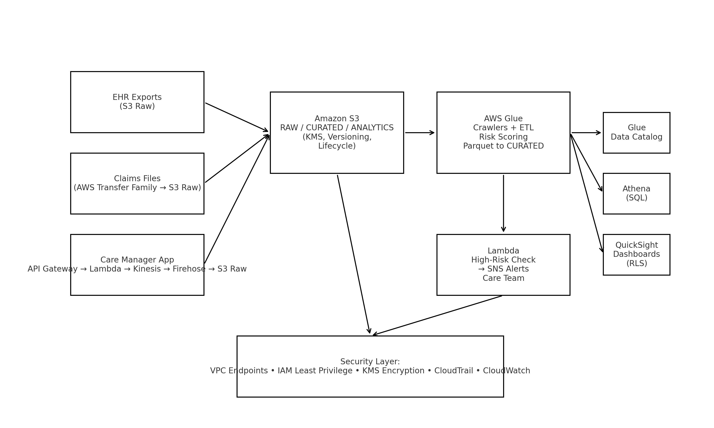

# 🏥 Healthcare Data Platform on AWS

A HIPAA-aligned data platform that centralizes Electronic Health Records (EHR), claims, and care-management notes for real-time population health analytics, risk scoring, and proactive patient outreach.

---

## 1. 🧩 Problem & Solution

### Business Problem
Healthcare organizations struggle with:
- Data silos across EHR, claims, and care management systems.
- No unified view of high-risk patients likely to be readmitted.
- Manual spreadsheet outreach and slow reporting.
- Compliance risk when PHI is shared insecurely.

### AWS Solution
This platform:
- Centralizes PHI into secure, encrypted data zones (raw → curated → analytics).
- Automates ingestion of EHR, claims, and nurse outreach notes.
- Uses AWS Glue ETL to clean, join, and compute patient risk scores.
- Exposes curated, governed analytics to Athena + QuickSight.
- Triggers Lambda + SNS alerts when a high-risk patient needs outreach.

**Impact:** Care teams get daily “call these patients now” alerts. Leadership gets live readmission KPIs. All access is auditable and least-privilege.

---

## 2. 🏗️ Architecture


**Layers**

**Ingestion**
- EHR exports → Amazon S3 (raw zone)
- Claims via AWS Transfer Family (SFTP) → S3
- Care Manager App → API Gateway → Lambda → Kinesis Stream → Kinesis Firehose → S3

**Storage / Zoning**
- Amazon S3 with `/raw/`, `/curated/`, `/analytics` (all SSE-KMS encrypted)

**Processing**
- AWS Glue Crawlers + Glue ETL Jobs (PySpark) to normalize formats, map ICD-10/CPT codes, and generate `risk_score`
- Outputs Parquet to `curated/`

**Analytics**
- AWS Glue Data Catalog → Amazon Athena → Amazon QuickSight dashboards (row-level security per clinic)

**Alerting**
- Lambda checks risk thresholds → SNS notifies care coordinators

**Security**
- Private VPC endpoints (S3, Glue, Athena)
- KMS customer-managed keys
- IAM least-privilege
- CloudTrail & CloudWatch auditing

---

## 3. ☁️ AWS Services Used

| Category          | AWS Service                             | Purpose                                                                 |
|-------------------|-----------------------------------------|-------------------------------------------------------------------------|
| Storage           | Amazon S3                               | Secure data lake (raw → curated → analytics)                           |
| Secure Transfer   | AWS Transfer Family (SFTP)              | Partner claims file ingestion                                          |
| API / Compute     | Amazon API Gateway, AWS Lambda          | Serverless ingestion of nurse outreach notes                           |
| Streaming         | Amazon Kinesis Streams & Kinesis Firehose | Near-real-time event capture to S3                                     |
| ETL               | AWS Glue Crawlers + Glue Jobs           | Standardize data, join sources, compute patient risk scores            |
| Metadata          | AWS Glue Data Catalog                   | Central schema registry for Athena / QuickSight                        |
| Query             | Amazon Athena                           | SQL analytics on Parquet in S3 (no warehouse cluster required)         |
| Dashboards        | Amazon QuickSight                       | KPI dashboards and patient outreach lists with row-level security      |
| Alerts            | Amazon SNS                              | Notify care teams when risk exceeds threshold                          |
| Security          | AWS KMS, IAM, VPC Endpoints             | Encryption, least-privilege, private network paths                     |
| Audit / Observability | AWS CloudTrail, Amazon CloudWatch   | Audit log retention, Glue/Lambda pipeline monitoring                    |

---

## 4. 💻 Code & Infrastructure as Code (IaC)

**Infra as Code:** Terraform examples in `/2-infra-iac/`
- `s3_buckets.tf`: Secure PHI data lake buckets with KMS encryption + lifecycle rules
- `kms_keys.tf`: Customer-managed KMS CMK for PHI
- `vpc.tf`: Private VPC, subnets, and S3 VPC endpoint for private data movement

**ETL Logic:** `/3-etl-glue/`
- `ehr_claims_transform.py`: Standardizes EHR + claims data
- `risk_scoring_job.py`: Computes patient readmission `risk_score`
- `glue_job_config.json`: Sample Glue job configuration

**Streaming Intake:** `/4-streaming-intake/`
- `api_gateway_openapi.yaml`: API definition nurses call after outreach
- `lambda_ingest_notes.py`: Lambda to send outreach events to Kinesis
- `firehose_delivery_stream.json`: Kinesis Firehose delivery to S3

**Analytics:** `/5-analytics/athena_queries/`
- `patient_risk_view.sql`: De-identified, curated patient risk view
- `readmission_rates.sql`: Readmission KPI
- `outreach_compliance.sql`: Follow-up compliance check

**Security & Compliance:** `/6-security-and-compliance/`
- `hipaa_controls_mapping.md`: How the design supports HIPAA technical safeguards
- `iam_least_privilege_examples.md`: Access model by persona
- `audit_and_monitoring.md`: CloudTrail, Config, Macie, alerting

---

## 5. 🎥 Demo / Walkthrough

**Step 1:** Nurse submits outreach note via API Gateway  
**Step 2:** Event lands in `s3://hcp-raw-zone/care_mgmt/` through Kinesis Firehose  
**Step 3:** Glue ETL joins EHR + claims + outreach, computes `risk_score`  
**Step 4:** Athena query:  
```sql
SELECT patient_id, risk_score, last_outreach_status
FROM curated_patient_risk
WHERE risk_score >= 80;
```
**Step 5:** QuickSight dashboard highlights “High-Risk Patients Requiring Outreach Today.”

Screenshots of these steps (with dummy data) go into `/5-analytics/quicksight_storyboard.md`.

---

## 6. 💰 Cost Optimization

- Used **serverless / on-demand services** (Lambda, Glue, Athena) instead of always-on EC2.
- **Athena + S3 Parquet** instead of running a full data warehouse 24/7.
- **Lifecycle policies**: S3 automatically pushes older data to Glacier Deep Archive.
- **Smaller Glue DPUs** and on-demand schedules for dev/test.
- Infra is defined as code so dev environments can be created/teared down fast.

---

## 7. ⚙️ Challenges & Lessons Learned

**Identity Resolution Across Systems**  
Different systems used different patient IDs. I built a master patient dimension in Glue to unify identity and enable cross-source analytics.

**Access Control vs. Analytics Speed**  
Analysts wanted full raw detail, but compliance enforces minimum necessary PHI access. I solved this by splitting `raw`, `curated`, and `analytics` zones and applying IAM boundaries + QuickSight row-level security.

**Alert Fatigue**  
Initial logic spammed care coordinators. I added business rules in Lambda to suppress duplicate alerts within 24 hours of a successful call.

**Cost vs. Performance**  
Chose Athena and Parquet on S3 for MVP to avoid paying for an idle data warehouse. Redshift Serverless is optional if query volume justifies it.

---

## 8. 🔐 Compliance Positioning

- All PHI is encrypted in transit (TLS) and at rest (SSE-KMS).
- Private VPC endpoints mean PHI data never traverses the public internet.
- Least-privilege IAM roles restrict who can access `raw` vs `analytics`.
- CloudTrail captures full access logs for auditing.
- The design uses only HIPAA-eligible AWS services and is intended to run under a BAA.

---