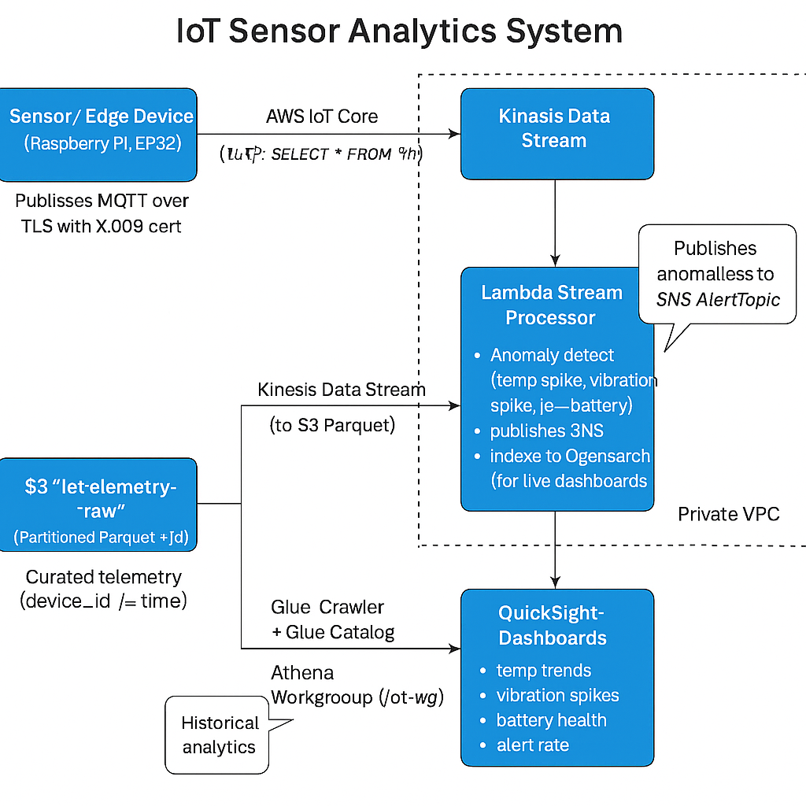

# 🛰️ IoT Sensor Analytics System — Edge-to-Cloud Telemetry on AWS

**Goal:** Securely ingest, process, alert on, and analyze real-time IoT telemetry (temperature, vibration, humidity, battery) from physical devices.



## 🔁 Data Flow
1. **Edge Device (Raspberry Pi / ESP32)** publishes MQTT messages with sensor data.
2. **AWS IoT Core** authenticates the device using X.509 certs and IoT policies.
3. **IoT Rule** routes telemetry to:
   - **Kinesis Data Stream** for real-time analytics & anomaly detection.
   - **Kinesis Firehose → S3 (Parquet)** for historical/BI analytics.
4. **Lambda Stream Processor**:
   - Flags anomalies (overheating, vibration spikes, low battery).
   - Sends alerts to **SNS AlertTopic** (maintenance / ops).
   - Indexes recent telemetry into **OpenSearch** for live dashboards.
   - Writes curated records into Firehose for clean lake storage.
5. **S3 Data Lake** + **Glue Crawler** + **Athena** give queryable time-series.
6. **QuickSight** builds dashboards: temps over time, alert rate, battery health.

## 📦 Repo Structure
```text
iot-sensor-analytics/
├── README.md
├── architecture/
│   ├── iot-architecture.png
│   └── iot-architecture.mmd
├── cdk/
│   ├── app.py
│   ├── cdk.json
│   ├── requirements.txt
│   └── iot_stack.py
├── lambda/
│   └── stream_processor/
│       └── index.py
├── analytics/
│   ├── athena/
│   │   ├── create_table.sql
│   │   └── queries/
│   │       ├── avg_temp_over_time.sql
│   │       ├── battery_health.sql
│   │       └── anomaly_counts.sql
│   ├── quicksight/
│   │   └── README.md
├── device-simulator/
│   ├── requirements.txt
│   └── publish_telemetry.py
├── ops/
│   ├── opensearch-index-template.json
│   └── cloudwatch-dashboard-notes.md
└── Makefile
```

## 🚀 Deploy (high-level)
1. `cd cdk`
2. Create venv, `pip install -r requirements.txt`, install `aws-cdk@2`
3. `cdk bootstrap`
4. `cdk deploy`

CDK will create:
- VPC (private subnets, endpoints)
- AWS IoT Rule → Kinesis Data Stream + Firehose
- Firehose → S3 (`iot-telemetry-raw`) with KMS
- Lambda Stream Processor (in VPC)
- SNS AlertTopic
- OpenSearch Domain (Cognito-protected dashboards)
- Glue Crawler + Athena Workgroup
- CloudWatch alarms + dashboard

## 🛠 Local Sensor Simulator
See `device-simulator/publish_telemetry.py` for an MQTT publisher that pretends to be a physical sensor.

---
© 2025 IoT Sensor Analytics
