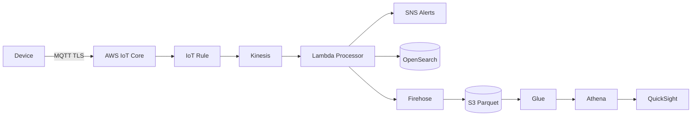

# 🛰️ IoT Sensor Analytics System — Edge-to-Cloud Telemetry on AWS

A production-style AWS Solutions Architect project for **secure MQTT ingestion, real-time anomaly detection, fleet monitoring, durable analytics, disaster recovery, and FinOps**.

This upgrade preserves the original architecture: **device → AWS IoT Core/X.509 → Kinesis → Lambda → SNS/OpenSearch + Firehose/S3 Parquet → Glue/Athena/QuickSight**. citeturn721433view0

## Executive Scenario
**Fleet:** 10,000 industrial devices  
**Reporting cadence:** 1 message/device/minute  
**Sustained rate:** 166.7 messages/sec  
**Peak burst target:** 1,000 messages/sec  
**Average payload:** 512 bytes  
**Daily messages:** 14,400,000  
**Raw telemetry:** 7.37 GB/day  
**30-day raw:** 221.18 GB  
**Modeled Parquet:** 55.30 GB/month  
**Availability:** 99.9%  
**RTO:** 60 minutes  
**RPO:** ≤5 minutes for accepted stream/lake data

## Architecture

```mermaid
flowchart LR
D[Device] -->|MQTT TLS| IOT[AWS IoT Core]
IOT --> RULE[IoT Rule]
RULE --> KDS[Kinesis]
KDS --> L[Lambda Processor]
L --> SNS[SNS Alerts]
L --> OS[(OpenSearch)]
L --> FH[Firehose]
FH --> S3[(S3 Parquet)]
S3 --> GLUE[Glue]
GLUE --> ATH[Athena]
ATH --> QS[QuickSight]
```

## Anomaly Logic
- temperature ≥ 85°C → HIGH_TEMPERATURE
- vibration ≥ 9 mm/s → HIGH_VIBRATION
- battery ≤ 15% → LOW_BATTERY
- humidity outside 10–90% → HUMIDITY_OUT_OF_RANGE

## Security
Unique X.509 certificate per device, scoped IoT policies, certificate rotation/revocation, KMS encryption, private OpenSearch reference design, blocked public S3 access, scoped IAM, CloudTrail logging, and strict telemetry schema validation.

## Reliability
Handles reconnect storms, duplicate/out-of-order events, poison messages, Kinesis backlog, Firehose failures, OpenSearch outages, silent devices, replay, and regional recovery.

## FinOps
Architecture planning model:
- Baseline: **$5,350/month**
- Optimization backlog: **$700/month**
- Optimized: **$4,650/month**
- Annual modeled savings: **$8,400**
- Reduction: **13.1%**

## Skills
AWS IoT Core • MQTT • X.509 • Kinesis • Lambda • Firehose • S3 • Parquet • Glue • Athena • QuickSight • OpenSearch • SNS • CloudWatch • CloudTrail • KMS • IAM • Python • AWS CDK • IoT Security • Fleet Monitoring • Capacity Planning • DR • FinOps
