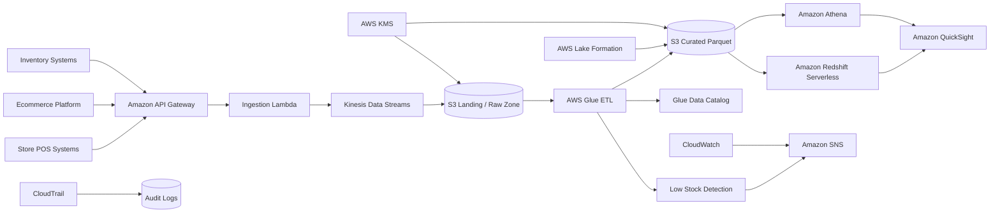

# 🛒 Retail Analytics Platform on AWS


> **Real-Time Sales, Inventory, Customer & Executive Analytics Architecture on AWS**

A production-style AWS Solutions Architect portfolio project demonstrating how a multi-channel retailer can replace next-day spreadsheet reporting with a secure, scalable, near-real-time analytics platform.

The platform combines **streaming ingestion, serverless ETL, a governed S3 data lake, Redshift Serverless, Athena, QuickSight, inventory alerts, disaster recovery, data quality, security controls, and FinOps governance**.

---

# 🎯 Business Problem

Retail leadership needs timely visibility into:

- Sales performance
- Gross margin
- Store performance
- Ecommerce performance
- Inventory availability
- Stockout risk
- Product sell-through
- Customer purchasing behavior
- Promotion effectiveness
- Returns
- Regional performance

Traditional reporting depends on next-day spreadsheets and manually consolidated files.

That creates several business problems:

- Stockouts are discovered too late
- Excess inventory increases carrying cost
- Poor-performing stores are identified after the fact
- Promotions cannot be evaluated quickly
- Executives lack one trusted version of performance
- Store and ecommerce data remain fragmented
- Analysts spend excessive time preparing data instead of analyzing it

The target state is an AWS-native analytics platform capable of moving from:

**transaction → ingestion → transformation → governed analytics → executive decision**

within minutes rather than the next business day.

---

# 🏢 Business Scenario

This portfolio models a national omnichannel retailer with:

| Architecture Assumption | Modeled Value |
|---|---:|
| Stores | **320** |
| Daily Transactions | **~4.2M** |
| Sales Channels | **Store POS + Ecommerce** |
| Analytics Freshness Target | **<30 minutes** |
| Ingestion Availability Target | **99.9%** |
| Recovery Time Objective | **2 hours** |
| Recovery Point Objective | **15 minutes** |

> These are explicit **architecture-planning assumptions** used to demonstrate capacity, reliability, and cost reasoning. They are not represented as live production measurements.

---

# 🏗️ Solution Architecture



---

# 🔄 End-to-End Data Flow

## 1. Retail Data Sources

The platform receives data from:

- Store POS systems
- Ecommerce transactions
- Inventory systems
- Product catalog systems
- Promotion systems
- Returns systems

Example sales event:

```json
{
  "order_id": "ORD-984312",
  "timestamp_utc": "2026-08-23T18:14:00Z",
  "store_id": "STORE-118",
  "channel": "STORE",
  "sku": "SKU-44912",
  "quantity": 2,
  "unit_price": 49.99,
  "discount": 5.00,
  "gross_sales": 99.98
}
```

---

## 2. Real-Time Ingestion

Amazon API Gateway provides the managed API entry point.

AWS Lambda performs lightweight validation and forwards valid events into Amazon Kinesis Data Streams.

The streaming layer supports:

- Sales transactions
- Inventory changes
- Ecommerce events
- Near-real-time operational analytics

---

## 3. Durable Landing Zone

Raw data is persisted in Amazon S3.

Recommended zones:

```text
s3://retail-analytics/
│
├── landing/
├── quarantine/
├── curated/
└── audit/
```

### Landing

Preserves incoming source data.

### Quarantine

Stores records that fail schema or data-quality validation.

### Curated

Contains cleaned, standardized, analytics-ready Parquet datasets.

### Audit

Contains operational and governance evidence.

---

# 🧱 Data Modeling

The analytics layer uses a star-schema design.

## Fact Tables

### `FactSales`

```text
date_key
store_key
product_key
channel_key
promotion_key
order_id
units
gross_sales
discounts
net_sales
cogs
returned_units
```

### `FactInventory`

```text
date_key
store_key
product_key
on_hand_units
in_transit_units
reorder_point
stockout_flag
inventory_cost
```

---

## Dimension Tables

### `DimDate`

```text
date_key
calendar_date
day_of_week
week_number
month
quarter
year
fiscal_period
```

### `DimStore`

```text
store_key
store_id
store_name
region
state
manager
timezone
store_format
```

### `DimProduct`

```text
product_key
sku
product_name
category
subcategory
brand
unit_cost
```

### `DimChannel`

```text
channel_key
channel_name
```

Examples:

```text
Store
Ecommerce
Marketplace
```

### `DimPromotion`

```text
promotion_key
promotion_name
promotion_type
start_date
end_date
discount_type
```

---

# 📊 Executive KPI Framework

| KPI | Definition |
|---|---|
| **Net Sales** | Gross Sales − Discounts − Returns |
| **Gross Margin** | Net Sales − COGS |
| **Gross Margin %** | Gross Margin ÷ Net Sales |
| **Average Order Value** | Net Sales ÷ Orders |
| **Units per Transaction** | Units Sold ÷ Orders |
| **Return Rate** | Returned Units ÷ Units Sold |
| **Sell-Through Rate** | Units Sold ÷ Units Available |
| **Stockout Rate** | Stockout SKU-Store Days ÷ Active SKU-Store Days |
| **Inventory Turnover** | Annualized COGS ÷ Average Inventory Cost |
| **Promotion Lift** | Promotional Sales Change vs Baseline |
| **Store Contribution** | Store Sales ÷ Total Sales |
| **Channel Contribution** | Channel Sales ÷ Total Sales |

---

# 📈 Executive Dashboard Design

## Dashboard 1 — Executive Overview

Primary KPIs:

- Net Sales
- Gross Margin
- Gross Margin %
- Average Order Value
- Units per Transaction
- Return Rate
- Stockout Rate
- Inventory Turnover

Supporting visuals:

- Daily/weekly sales trend
- Regional sales contribution
- Store ranking
- Channel mix
- Category performance
- Margin trend

---

## Dashboard 2 — Store Performance

Answers:

- Which stores generate the highest sales?
- Which stores have declining margin?
- Which stores are missing targets?
- Which stores have excessive returns?
- Which regions are outperforming?

Visuals:

- Store ranking
- Revenue vs target
- Gross margin
- Average basket
- Regional map
- Store variance table

---

## Dashboard 3 — Inventory Risk

Focuses on:

- Low-stock SKUs
- Stockouts
- Overstock
- Sell-through
- Inventory turnover
- Slow-moving inventory

Example operational action:

```text
IF OnHandUnits <= ReorderPoint
THEN Generate Low Stock Alert
```

Alerts can be routed through Amazon SNS to store or operations leadership.

---

## Dashboard 4 — Product Performance

Measures:

- Product revenue
- Product margin
- Category contribution
- Units sold
- Return rate
- Sell-through
- Promotion performance

Use cases:

- assortment optimization
- markdown decisions
- category planning
- procurement prioritization

---

## Dashboard 5 — Channel Analytics

Compares:

- Ecommerce
- Physical stores
- Other retail channels

KPIs:

- Revenue
- AOV
- Margin
- Units/order
- Return rate
- Growth
- Contribution

---

## Dashboard 6 — Promotion Analytics

Answers:

- Did the promotion increase sales?
- Did higher volume reduce margin?
- Which products responded best?
- Did sales remain elevated after promotion?

Metrics:

- Baseline sales
- Promotional sales
- Promotion lift
- Margin impact
- Incremental revenue
- Incremental units

---

# 🧹 Data Quality Framework

Trusted executive reporting requires data validation before curated datasets are published.

Core rules include:

### Order Integrity

```text
OrderID must be unique within source system
```

### Financial Reconciliation

```text
Net Sales =
Gross Sales
− Discounts
− Returns Adjustments
```

### Domain Validation

```text
Units >= 0
COGS >= 0
Price >= 0
```

### Referential Integrity

All:

```text
StoreKey
ProductKey
ChannelKey
PromotionKey
```

must resolve to valid dimensions.

### Timestamp Validation

Transactions cannot be materially future-dated.

### Batch Reconciliation

Each ingestion cycle reconciles:

```text
Source Count
      ↓
Landing Count
      ↓
Validated Count
      ↓
Curated Count
```

Failed records remain in quarantine rather than silently entering executive reporting.

---

# ✅ Data Reconciliation

Every batch should reconcile:

- Source order count
- Ingested order count
- Curated order count
- Gross sales
- Net sales
- Units
- Returned units

Example pass criteria:

```text
Count variance = 0

Net Sales variance =
< $0.01 rounding tolerance per batch
```

Executive dashboards refresh only after reconciliation succeeds.

---

# ⚡ Streaming vs Batch Design

The platform intentionally uses both patterns.

## Streaming

Used for:

- POS sales
- Ecommerce transactions
- Inventory changes
- Low-stock detection
- Operational KPIs

## Batch

Used for:

- Large store extracts
- Partner files
- Historical backfills
- Product master updates
- Bulk inventory snapshots

This avoids forcing every workload into a streaming architecture when batch is simpler and more economical.

---

# 📦 S3 Partitioning Strategy

Curated data is stored in Parquet.

Example:

```text
s3://retail-curated/sales/
    event_date=2026-08-23/
        channel=store/
            region=southeast/
                part-00001.parquet
```

Partitioning is designed around frequently filtered analytical dimensions.

Avoid high-cardinality partitioning such as:

```text
order_id
customer_id
sku
```

because it produces excessive partitions and small files.

---

# 🔎 Athena

Amazon Athena supports:

- Ad hoc SQL
- Validation
- Data reconciliation
- Data exploration
- Operational investigations

Example:

```sql
SELECT
    channel,
    SUM(net_sales) AS sales,
    SUM(gross_margin) AS margin
FROM fact_sales
WHERE event_date BETWEEN DATE '2026-08-01'
                     AND DATE '2026-08-31'
GROUP BY channel
ORDER BY sales DESC;
```

Inventory risk:

```sql
SELECT
    store_id,
    SUM(stockout_flag) AS stockout_sku_days
FROM fact_inventory
GROUP BY store_id
ORDER BY stockout_sku_days DESC;
```

---

# 🏢 Redshift Serverless

Amazon Redshift Serverless is used for recurring BI workloads requiring:

- Higher concurrency
- Dimensional models
- Predictable dashboard queries
- Reusable semantic reporting
- Large multi-table joins

Athena remains available for lower-frequency ad hoc analysis.

---

# 🔐 Security Architecture

Security is incorporated into the platform design rather than added after development.

## Identity

Human access uses federated identities.

Roles are separated between:

```text
RetailAnalyticsReadOnly
RetailAnalyticsEngineer
RetailBIUser
RetailSecurityAudit
RetailPlatformAdmin
```

---

## Data Governance

AWS Lake Formation manages:

- Database permissions
- Table permissions
- Column access
- Governed analytics datasets

Store managers can be limited to data relevant to their stores or regions.

---

## Encryption

At rest:

```text
AWS KMS
```

In transit:

```text
TLS
```

---

## S3

Controls include:

- Public access block
- Encryption
- Versioning
- Lifecycle policies
- Access logging where required

---

## Detection

Security telemetry includes:

- AWS CloudTrail
- AWS Config
- Amazon GuardDuty
- AWS Security Hub
- CloudWatch

---

# 🛡️ Threat Model

Key risks include:

| Threat | Primary Control |
|---|---|
| Stolen credentials | Federation + MFA |
| Overbroad analyst access | Lake Formation |
| Public data exposure | S3 Public Access Block |
| Privilege escalation | Least-privilege IAM |
| Data destruction | Versioning + backups |
| Unauthorized infrastructure changes | IaC + CI/CD |
| Sensitive-data exposure | Data classification + governed marts |
| Unusual API activity | CloudTrail + GuardDuty |

---

# 📡 Observability

The platform monitors four core areas.

## Ingestion

- API errors
- Lambda errors
- Kinesis throughput
- Kinesis iterator age

## ETL

- Glue job success
- Glue failures
- Processing duration
- Data-quality failures

## Analytics

- Redshift query performance
- Athena scanned bytes
- QuickSight refresh failures

## Business Operations

- Missing store feeds
- Inventory-feed delays
- Data freshness
- Low-stock alerts

---

# 🚨 Example Alarm Catalog

| Alarm | Threshold | Severity |
|---|---|---|
| Lambda Errors | >1% for 5 minutes | SEV-2 |
| Kinesis Iterator Age | >60 sec | SEV-2 |
| Glue Job Failure | Any production failure | SEV-2 |
| Missing Store Batch | Beyond expected SLA | SEV-2 |
| Redshift Query Failure Spike | Sustained | SEV-3 |
| Data Quality Failure | Any executive dataset | SEV-2 |
| Stockout Threshold | SKU below reorder level | Business Alert |

---

# 🔁 Disaster Recovery

## Recovery Objectives

**RTO:** 2 hours  
**RPO:** 15 minutes

Amazon S3 is treated as the durable analytics source of truth.

For a production implementation:

- Critical S3 data is replicated/backed up cross-region
- Infrastructure is reproducible through IaC
- Glue/Lake Formation metadata is recoverable
- Redshift snapshots or reproducible marts are maintained
- BI datasets can be rebuilt after recovery

---

## Recovery Sequence

```text
Regional Incident
      ↓
Confirm Latest Durable Data
      ↓
Deploy Secondary Infrastructure
      ↓
Restore Catalog / Analytics Layer
      ↓
Validate Data Counts
      ↓
Validate Financial Totals
      ↓
Restore BI Access
```

Executive dashboards are not restored until underlying data validation passes.

---

# 🧪 Acceptance Testing

The architecture should pass:

### Data

- Source/curated counts reconcile
- Financial metrics reconcile
- Invalid dimension keys fail validation
- Bad records enter quarantine

### Performance

- Streaming data appears in analytics within target
- BI queries complete within acceptable SLA
- Kinesis backlog does not grow without bound

### Reliability

- Missing store feed generates alert
- ETL failure does not overwrite trusted dataset
- Prior curated partition remains available

### Security

- Unauthorized role cannot access restricted data
- S3 objects cannot be made public
- Infrastructure changes are auditable

### DR

Recovery procedures are documented against:

**2-hour RTO / 15-minute RPO**

---

# 💰 FinOps

Cloud cost is treated as an architecture requirement.

## Modeled Planning Baseline

| Metric | Modeled Value |
|---|---:|
| Monthly Baseline | **$13,200** |
| Monthly Optimization Backlog | **$2,180** |
| Optimized Run Rate | **$11,020** |
| Annualized Opportunity | **$26,160** |
| Modeled Reduction | **~16.5%** |

> These values are **architecture-planning assumptions**, not live AWS billing results.

---

# 💡 Cost Optimization Opportunities

### S3

- Parquet
- Compression
- Lifecycle rules
- Storage-class transitions

### Athena

- Partition pruning
- Column projection
- Workgroup scan limits

### Glue

- Right-sized workers
- Job-duration monitoring
- Avoid unnecessary full-table transforms

### Redshift Serverless

- Usage limits
- Capacity controls
- Query optimization
- Workload scheduling

### QuickSight

- Appropriate user licensing
- Refresh scheduling
- SPICE usage review

### Kinesis

Review:

```text
On-Demand
vs
Provisioned
```

after production traffic patterns become stable.

---

# 📉 FinOps Decision Rule

Cost optimization should **not** compromise:

- Required availability
- Security controls
- RTO/RPO
- Data quality
- Executive reporting integrity

The proper sequence is:

```text
Observe
  ↓
Remove Waste
  ↓
Rightsize
  ↓
Optimize Architecture
  ↓
Evaluate Commitments
```

---

# 🗂️ Architecture Decision Records

The upgraded project documents major architecture decisions including:

- Hybrid streaming + batch ingestion
- Parquet for curated data
- Redshift Serverless for recurring BI
- Lake Formation for governance
- S3 as durable analytics truth
- IaC-based recovery

---

# 📁 Recommended Repository Structure

```text
retail-analytics-platform/
│
├── README.md
│
├── architecture/
│   ├── Solution_Design.md
│   └── adrs/
│
├── data/
│   ├── Data_Model.md
│   └── Data_Quality_Rules.md
│
├── analytics/
│   ├── KPI_Catalog.md
│   ├── athena_queries.sql
│   └── QuickSight_Design.md
│
├── cdk/
│   ├── app.py
│   ├── retail_stack.py
│   ├── cdk.json
│   └── requirements.txt
│
├── security/
│   └── Security_Model.md
│
├── resilience/
│   └── DR_Plan.md
│
├── ops/
│   └── Operations_Runbook.md
│
├── finops/
│   ├── Cost_Model.csv
│   └── Optimization_Plan.md
│
├── evidence/
│   ├── Data_Reconciliation_Report.md
│   ├── Executive_Dashboard_Acceptance.md
│   ├── Simulated_Load_and_Freshness_Report.md
│   ├── Validation_Report.md
│   └── artifact_manifest.csv
│
├── validation/
│   └── validate.py
│
└── .github/
    └── workflows/
        └── ci.yml
```

---

# 🧾 Verification Evidence

The `evidence/` folder provides recruiter/interviewer-ready proof of the architecture process, including:

- Data reconciliation controls
- Executive dashboard acceptance requirements
- Load/freshness test methodology
- Validation report
- Artifact SHA-256 manifest

Any test or benchmark that was not executed against a live AWS environment is explicitly labeled **modeled** or **simulated**.

---

# 🧰 AWS Services Demonstrated

### Compute & Integration

- AWS Lambda
- Amazon API Gateway
- Amazon SNS

### Streaming

- Amazon Kinesis Data Streams

### Data Lake

- Amazon S3
- AWS Glue
- AWS Glue Data Catalog

### Analytics

- Amazon Athena
- Amazon Redshift Serverless
- Amazon QuickSight

### Governance

- AWS Lake Formation

### Security

- AWS IAM
- AWS KMS
- AWS CloudTrail
- AWS Config
- Amazon GuardDuty
- AWS Security Hub

### Operations

- Amazon CloudWatch

### Infrastructure

- AWS CDK / Infrastructure as Code

---

# 🎓 Skills Demonstrated

**AWS Solutions Architecture • Retail Analytics • Data Engineering • Streaming Architecture • Data Lakes • Amazon Kinesis • AWS Lambda • Amazon S3 • AWS Glue • Amazon Athena • Redshift Serverless • QuickSight • Lake Formation • Dimensional Modeling • Star Schema • Data Quality • Data Governance • IAM • KMS • CloudTrail • CloudWatch • Disaster Recovery • RTO/RPO • FinOps • Executive Reporting • Business Intelligence • Infrastructure as Code**

---

# 💼 Interview Story

A concise way to explain the project:

> I designed an AWS retail analytics platform to replace next-day spreadsheet reporting with near-real-time sales and inventory analytics. The architecture uses API Gateway, Lambda and Kinesis for ingestion, S3 as the durable data lake, Glue for transformation, Athena and Redshift Serverless for analytics, and QuickSight for executive dashboards. I also designed Lake Formation governance, KMS encryption, data-quality reconciliation, low-stock alerts, observability, disaster recovery, and a FinOps model. The architecture is modeled for a 320-store omnichannel retailer processing roughly 4.2 million transactions per day, with a sub-30-minute analytics freshness target.

---

# 🏁 Final Takeaway

This project demonstrates much more than building an AWS data pipeline.

It demonstrates the full Solutions Architect lifecycle:

```text
Business Problem
      ↓
Requirements
      ↓
Architecture
      ↓
Streaming + Batch Ingestion
      ↓
Data Lake
      ↓
Transformation
      ↓
Data Quality
      ↓
Governance
      ↓
Analytics Warehouse
      ↓
Executive BI
      ↓
Security
      ↓
Observability
      ↓
Disaster Recovery
      ↓
FinOps
      ↓
Validation
      ↓
Business Decision Support
```

The result is a **secure, scalable, governed, cost-aware retail analytics reference architecture** designed to connect AWS technical decisions directly to measurable retail business outcomes.

---

## ⚠️ Portfolio Scope

This repository represents a **simulated architecture engagement** created to demonstrate AWS Solutions Architect skills.

Transaction volumes, latency objectives, cost models, savings estimates, and recovery targets are architecture-planning assumptions unless explicitly supported by executed test evidence.

The project does **not** claim that these resources are currently operating in a live production AWS environment.
